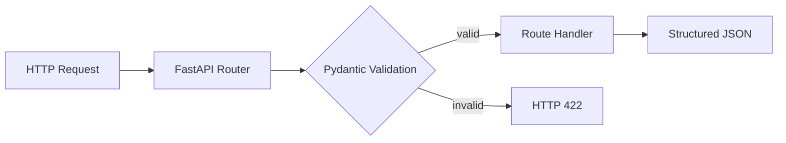

# TMS Agent Phase 0 Day 1

第一个 Python Agent Runtime 骨架。当前范围仅包含 FastAPI、Pydantic 输入校验、基础路由和 pytest，不提前引入 RAG、LangGraph、MCP 或 SSE。

## 今日目标

- `/health` 可访问。
- 三个核心业务 Schema 可校验。
- 非法字段、类型、枚举和值域返回 `422`。
- `/docs` 提供 Swagger API 文档。

## 工程结构

```text
app/
  main.py
  routes.py
  schemas.py
tests/
  test_health.py
  test_schemas.py
docs/
  java_to_python_mapping.md
  cursor_efficiency_log.md
.codex/rules/
  ai-agent-engineering.mdc
AGENTS.md
```

## 请求流转



## Windows 启动

```powershell
.\.venv\Scripts\Activate.ps1
python -m uvicorn app.main:app --reload --port 8000
```

在 PyCharm 中，可直接右键项目根目录下的 `run.py`，选择运行。

访问：

- Health: `http://127.0.0.1:8000/health`
- Swagger: `http://127.0.0.1:8000/docs`

## 运行测试

```powershell
.\.venv\Scripts\python.exe -m pytest -q
```

## API

| Method | Path | 用途 |
|---|---|---|
| GET | `/health` | 健康检查 |
| POST | `/api/v1/device-status` | 校验设备状态 |
| POST | `/api/v1/elderly-records` | 校验老人健康记录 |
| POST | `/api/v1/ott-queries` | 校验 OTT 查询 |

## 当前边界

今天不实现正式故障注入。后续需要覆盖字段缺失、更多类型错误、调用超时和外部脏数据。
