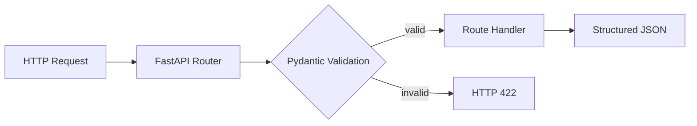

# Phase 0 Day 1 对话提示词与执行汇总

## 1. 项目背景

项目名称：`tms-agent-phase0-day1`

项目定位：为 TMS 智能运维 Agent 建立第一个 Python Runtime 骨架，完成 FastAPI、Pydantic 输入校验、基础 API、自动化测试和工程文档。

Day 1 严格限制范围：

- 只实现 FastAPI、Pydantic、pytest 和基础文档。
- 不提前实现 RAG、LangGraph、MCP、SSE 或前端。
- 不添加与三个业务 Schema 无关的字段。
- Schema 必须有正常、异常和边界测试。

## 2. 原始学习任务

### 2.1 Python async/await 与 Java 线程模型

需要理解：

- Python `asyncio` 是事件循环与协程，不是多线程。
- Java `ThreadPoolExecutor` 通过工作线程并发执行任务。
- Agent Runtime 的 LLM、Redis、Qdrant 和设备服务调用主要是 I/O 密集型任务。
- Python 更适合执行面异步编排，Java 更适合企业管理面。

### 2.2 Pydantic 数据校验

需要理解：

- Pydantic 不只是 DTO。
- 它负责类型、必填、默认值、范围、枚举和未知字段校验。
- 非法输入不能进入 ReAct、Tool Calling 或 Checkpoint。
- Schema 是 Agent Runtime 的第一道数据安全边界。

### 2.3 FastAPI 与 Spring Boot 思维迁移

核心映射：

| Java/Spring Boot | Python/FastAPI |
|---|---|
| `Application.java` | `app/main.py` |
| `@RestController` | `APIRouter` |
| DTO/VO | Pydantic `BaseModel` |
| Bean Validation | Pydantic `Field` |
| `@ControllerAdvice` | Exception Handler / `HTTPException` |
| Swagger | `/docs` |

设计结论：Java Control Plane 负责认证、审计和治理；Python Runtime 负责 Agent 执行、模型调用和工具编排。

## 3. SDD 汇总

### 3.1 Spec

| 项目 | 内容 |
|---|---|
| 要解决的问题 | 建立 TMS Agent Python Runtime 骨架并定义业务输入 Schema |
| 输入 | 设备状态、老人健康记录、OTT 查询 |
| 输出 | 可运行 FastAPI 服务与 Pydantic 模型 |
| 成功标准 | `/health` 可访问，Schema 测试通过，非法输入被拒绝 |
| 失败边界 | 环境失败、服务无法启动、字段设计混乱、缺少测试 |

### 3.2 Design

核心模块：

```text
app/main.py
app/routes.py
app/schemas.py
tests/
docs/
```

请求流：



### 3.3 Development

Codex 协助范围：

- FastAPI 最小骨架。
- README 和 pytest 骨架。
- 三个 Schema 字段、约束和测试。
- PyCharm 可运行入口。

禁止事项：

- 不复制无关字段。
- 不允许无测试提交。
- Harness 核心决策不能在缺少工程师设计的情况下自动生成。

## 4. Schema 提示词汇总

### 4.1 DeviceStatusSchema

字段：

- `device_id: str`，长度至少 3。
- `region: str`，不能为空。
- `android_version: str`。
- `firmware_version: str`。
- `online: bool`。
- `error_code: str | None`。
- `failure_rate_7d: float`，范围为 0 到 1。
- `last_seen_at: datetime`。

### 4.2 ElderlyRecordSchema

字段：

- `elder_id: str`，不能为空。
- `age: int`，范围为 0 到 120。
- `systolic_bp: int`，不能为负数。
- `diastolic_bp: int`，不能为负数。
- `has_chronic_disease: bool`。
- `latest_alert: str | None`。
- `updated_at: datetime`。

### 4.3 OTTQuerySchema

字段：

- `query_id: str`。
- `tenant_id: str`，不能为空。
- `query_text: str`，长度至少 5。
- `channel`，仅允许 `web`、`tv`、`miniapp`。
- `include_history: bool`。
- `max_results: int`，范围为 1 到 20。

## 5. 测试提示词汇总

必须覆盖：

- 三个 Schema 的合法样例。
- 三个 Schema 的非法样例。
- `failure_rate_7d=0`。
- `failure_rate_7d=1`。
- `max_results=20`。
- 必填字段缺失。
- 非法枚举。
- 数值越界。
- 类型错误。
- 未知字段。
- HTTP 请求校验失败返回 422。
- `/health` 和 `/docs` 可访问。

后续故障测试仅记录，不在 Day 1 实现：

- 外部服务超时。
- 上游脏数据。
- LLM 调用异常。
- Redis、Qdrant 和设备服务不可用。

## 6. 实际执行记录

### 6.1 环境

- 系统 PATH 未配置 Python。
- 使用 Codex 捆绑 Python 3.12.13 创建项目 `.venv`。
- 安装 FastAPI、Uvicorn、Pydantic、pytest 和 httpx。
- 生成固定版本的 `requirements.txt`。

### 6.2 代码

完成：

- `app/main.py`：创建 FastAPI 应用。
- `app/routes.py`：健康检查和三个业务输入 API。
- `app/schemas.py`：三个严格 Pydantic v2 Schema。
- `run.py`：PyCharm 直接运行入口。

校验策略：

- 开启严格类型校验。
- 禁止未知字段。
- 自动清理字符串首尾空格。
- `datetime` 字段允许从 HTTP JSON 的 ISO 8601 字符串受控解析。

### 6.3 测试

最终结果：

```text
25 passed, 1 warning in 0.41s
```

测试过程中发现全局严格模式会拒绝合法的 ISO 8601 时间字符串。解决方案不是关闭严格模式，而是只对两个 `datetime` 字段开放受控解析。

### 6.4 服务验证

- Uvicorn 启动成功。
- `GET /health` 返回 `status=ok`。
- `GET /docs` 返回 HTTP 200。
- Swagger UI 加载成功。

## 7. IDE 对话与排障

### 7.1 VS Code

解释器：

```text
C:\ai\day-001\tms-agent-phase0-day1\.venv\Scripts\python.exe
```

启动命令：

```powershell
python -m uvicorn app.main:app --reload --port 8000
```

### 7.2 PyCharm

问题：最初运行了 `.venv\Scripts\Activate.ps1`。该文件只用于激活虚拟环境，不是应用入口。

另一个问题：直接运行 `app/main.py` 时，Python 的模块搜索根目录变成 `app/`，导致 `from app.routes` 导入失败。

最终方案：

1. PyCharm 解释器选择项目 `.venv\Scripts\python.exe`。
2. 运行项目根目录的 `run.py`。
3. 不直接运行 `Activate.ps1` 或 `app/main.py`。

## 8. 核心面试结论

> 在生产级 Agent 系统中，输入数据不能直接进入 ReAct 或 Tool Calling，因为脏数据会污染状态机、工具参数和 Checkpoint。我的设计是在 Runtime 入口使用 Pydantic 做严格校验。代价是前期 Schema 设计更重，收益是减少非法状态、工具误调用和后续恢复成本。

## 9. 当前验收结论

| 验收项 | 结果 |
|---|---|
| 工程目录 | 通过 |
| 项目虚拟环境 | 通过 |
| 依赖文件 | 通过 |
| FastAPI 启动 | 通过 |
| `/health` | 通过 |
| `/docs` | 通过 |
| 三个 Schema | 通过 |
| 非法输入拒绝 | 通过 |
| pytest | 25 项通过 |
| VS Code 运行方式 | 已记录 |
| PyCharm 运行方式 | 已修复并记录 |

