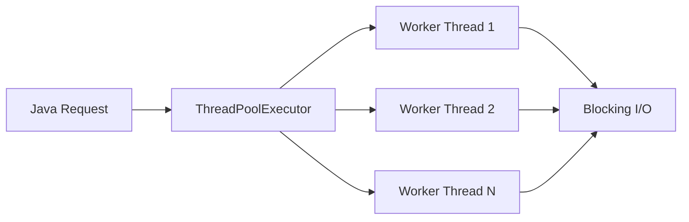
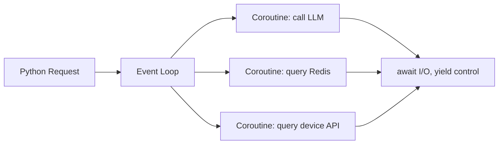

# Python async/await vs Java ThreadPoolExecutor

## 1. 一句话结论

Java 线程池靠多个 OS 线程并发执行任务；Python `asyncio` 靠单线程事件循环在 I/O 等待时主动让出执行权。  
Agent Runtime 里大量工作是调用 LLM、Redis、Qdrant、设备服务，所以 Python 异步很适合做高并发 I/O 编排。

## 2. 核心模型

## 3. Java 线程池

`ThreadPoolExecutor` 的本质是把任务提交给有限数量的工作线程。

优点：

- 适合阻塞式代码，生态成熟。
- 多核 CPU 利用更直接。
- 对 Spring Boot、Servlet、JDBC、传统中间件非常友好。

代价：

- 每个线程有栈内存和上下文切换成本。
- 高并发阻塞 I/O 时，线程会大量挂起等待。
- 线程池、队列、拒绝策略、超时、隔离都要仔细设计。

典型适用：

- Java Control Plane。
- 管理 API。
- 认证、审计、计费、权限、DLQ 重放入口。
- 与存量 Java/Spring Cloud 系统集成。

## 4. Python asyncio

`asyncio` 的本质是事件循环加协程。协程不是线程，不会自动并行执行 CPU 计算。  
只有遇到 `await`，协程才把控制权交回事件循环，让其他协程继续跑。

优点：

- 适合 LLM API、Redis、Qdrant、HTTP 工具调用等 I/O 密集场景。
- 单线程也能挂起大量等待中的任务。
- 编排复杂 I/O 流程时代码结构清晰。

代价：

- CPU 密集任务会阻塞事件循环。
- 不能在异步函数里直接调用长时间阻塞代码。
- 需要配合超时、取消、限流和异常传播。

典型适用：

- Agent Runtime。
- LLM 调用。
- Tool Calling。
- RAG 检索。
- SSE 流式输出。
- 长任务状态编排。

## 5. 本质差异

| 对比项 | Java ThreadPoolExecutor | Python asyncio |
|---|---|---|
| 并发单位 | OS 线程 | 协程 |
| 调度方式 | JVM/OS 抢占式调度 | 事件循环协作式调度 |
| I/O 等待 | 线程阻塞 | `await` 让出执行权 |
| CPU 任务 | 更适合 | 不适合直接放事件循环 |
| 资源成本 | 线程成本较高 | 协程成本较低 |
| 失败风险 | 线程池耗尽、队列堆积 | 阻塞事件循环、忘记 await |

## 6. Agent 场景判断

TMS Agent 的一次任务可能包含：

1. 调 LLM 生成诊断计划。
2. 查设备状态服务。
3. 查 RAG 知识库。
4. 查 Redis Checkpoint。
5. 调 OTA 工具。
6. 推送 SSE 事件。

这些步骤大多在等外部服务返回。用 Python 异步可以让 Runtime 在等待 A 服务时继续处理 B 任务，而不是让线程空等。

## 7. 面试表达

我不会说 Python 异步比 Java 线程池更强。它们解决的问题不同。  
Java 更适合企业管理面和存量系统集成；Python 更适合 Agent Runtime 的 I/O 编排。我的设计是 Java 做 Control Plane，Python 做 Runtime，把两边优势分开使用。

