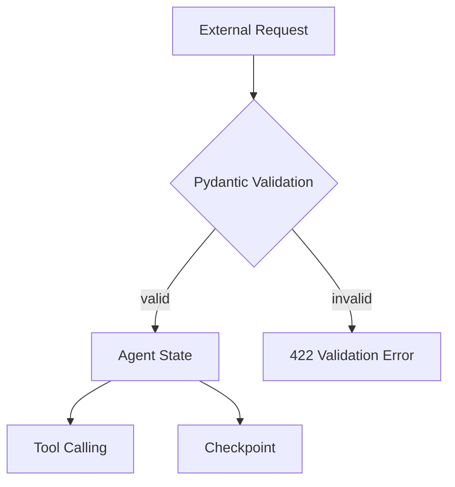

# Pydantic 数据校验原理

## 1. 一句话结论

Pydantic 不是简单 DTO。它是 Runtime 入口的数据防线：在请求进入 Agent 状态机、Tool Calling、Checkpoint 之前，先完成类型转换、必填校验、范围约束和异常拦截。

## 2. 数据进入 Agent 的风险



如果没有 Schema 校验：

- `device_id` 为空，可能查错设备。
- `failure_rate_7d=9.8`，可能误判为高危批量故障。
- `tenant_id` 缺失，可能串租户查询。
- `max_results=10000`，可能拖垮检索服务。

## 3. Schema

Pydantic 的 `BaseModel` 定义结构化数据边界。

```python
from pydantic import BaseModel, Field

class DeviceStatusSchema(BaseModel):
    device_id: str = Field(min_length=3)
    region: str = Field(min_length=1)
    failure_rate_7d: float = Field(ge=0, le=1)
```

它表达三件事：

1. 字段必须存在。
2. 类型必须匹配或可安全转换。
3. 值必须满足业务约束。

## 4. 类型约束

Pydantic 会根据类型注解做校验和转换。

常见类型：

- `str`
- `int`
- `float`
- `bool`
- `datetime`
- `list[str]`
- `Literal["web", "tv", "miniapp"]`

工程意义：

- 把脏输入挡在 Runtime 入口。
- 让 Agent 状态结构稳定。
- 让工具参数更可靠。
- 让测试用例能覆盖数据边界。

## 5. 默认值

默认值适合表达业务上的合理缺省。

```python
include_history: bool = False
max_results: int = Field(default=5, ge=1, le=20)
```

默认值不能滥用。  
如果字段缺失会影响安全、权限、租户隔离或设备定位，就不应该给默认值，应该让请求失败。

## 6. Field 约束

`Field` 用来声明值域、长度和说明。

常用约束：

| 约束 | 含义 |
|---|---|
| `min_length` | 字符串最小长度 |
| `max_length` | 字符串最大长度 |
| `ge` | 大于等于 |
| `gt` | 大于 |
| `le` | 小于等于 |
| `lt` | 小于 |
| `description` | 文档说明 |

## 7. 异常

FastAPI 集成 Pydantic 后，校验失败默认返回 `422 Unprocessable Entity`。

这不是坏事。  
在 Agent 系统里，非法请求不应该进入 ReAct 循环，因为一旦进入状态机，后续 Checkpoint、重试、工具调用都会被污染。

## 8. 生产级价值

Pydantic 在 Agent Runtime 中解决的是确定性边界问题。

LLM 输出天然不稳定，工具调用风险高，所以入口数据必须稳定。  
Schema 越清晰，后面的 Agent 编排、工具权限、Checkpoint、Eval 才越容易治理。

## 9. 面试表达

我的判断是：Pydantic 是 Agent Runtime 的第一道 Harness。  
它不是为了写漂亮 DTO，而是为了防止非法输入进入状态机和工具链。代价是前期 Schema 设计更重，收益是减少非法状态、误调用和后续恢复成本。

