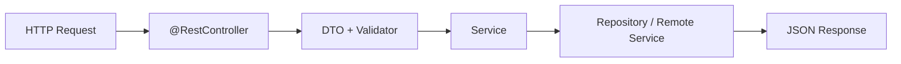

# FastAPI 工程结构与 Spring Boot 思维迁移

## 1. 一句话结论

FastAPI 不是简单的 Python 版 Controller。它更适合作为 AI Runtime 的轻量入口，承接异步 API、Schema 校验、SSE、工具调用和 Agent 编排。

## 2. 典型结构

```text
app/
  main.py        # 创建 FastAPI app，挂载路由
  routes.py      # API 路由
  schemas.py     # Pydantic Schema
  services.py    # 业务逻辑
  clients.py     # LLM/Redis/Qdrant/设备服务客户端
tests/
  test_health.py
  test_schemas.py
docs/
```

对应 Spring Boot：

| Spring Boot | FastAPI |
|---|---|
| `Application.java` | `main.py` |
| `@RestController` | `APIRouter` |
| DTO/VO | Pydantic `BaseModel` |
| Service | 普通 Python service 函数或类 |
| Bean Validation | `Field` 约束 |
| `@ControllerAdvice` | Exception handler |
| Swagger/OpenAPI | 自动 `/docs` |

## 3. 请求流转


Spring Boot 常见流转：



## 4. 为什么 FastAPI 适合 Runtime

Agent Runtime 的入口通常需要：

- 快速定义 API。
- 自动生成 OpenAPI 文档。
- 强 Schema 校验。
- 原生支持异步函数。
- 支持 Streaming/SSE。
- 容易接 LangGraph、LLM SDK、向量库和 Python AI 生态。

这些是 Python AI 生态的优势。

## 5. 为什么不是全 Java

全 Java 可以做，但成本更高：

- LLM、RAG、Agent 框架生态更偏 Python。
- Tool Calling、Rerank、Embedding、Eval 工具链 Python 更丰富。
- 异步 I/O 编排在 Python Runtime 中更轻。

但 Java 仍然重要：

- 存量系统集成。
- 认证鉴权。
- 审计日志。
- 成本治理。
- 任务列表。
- Prompt 版本。
- DLQ 重放入口。

所以架构分工是：Python 做执行面，Java 做管理面。

## 6. 工程迁移心法

不要把 FastAPI 机械理解成 Controller。

更准确的理解：

- `Router` 是 Runtime 入口。
- `Schema` 是状态机边界。
- `Service` 是 Agent 编排前置逻辑。
- `Client` 是外部工具和模型适配。
- `Exception` 是非法输入和执行失败的分流点。
- `SSE` 是长任务实时反馈通道。

## 7. 面试表达

我从 Spring Boot 迁移到 FastAPI，不是因为 Java 不行，而是因为执行面需要贴近 AI 工具链。  
Java 保留在 Control Plane，负责企业治理；Python 负责 Runtime，负责 Agent 执行、异步工具调用和模型生态集成。这是分工，不是替代。

