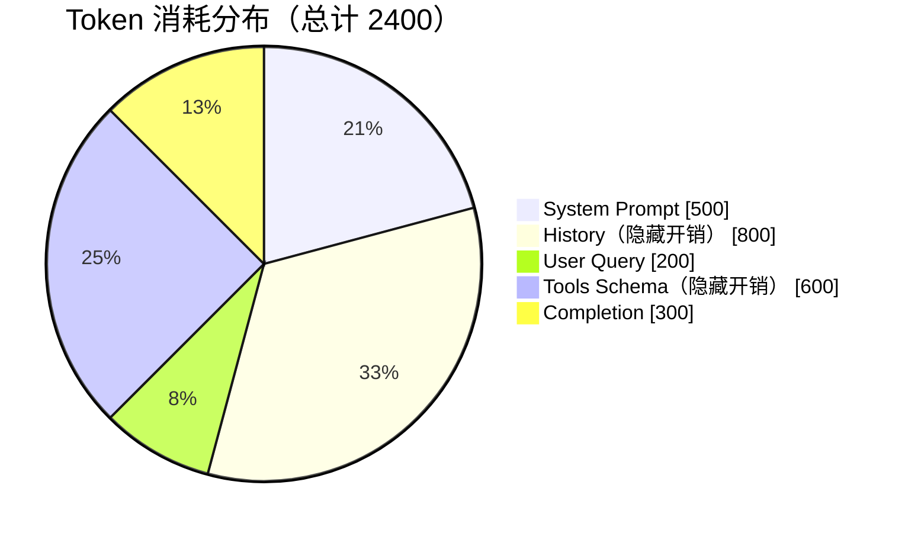
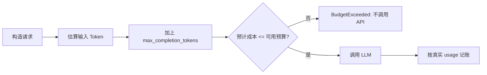

# Token 经济学与上下文窗口

## 1. 成本不是只有 User Query

一次 LLM 请求的计费输入通常包括：

```text
System Prompt   500
History         800  <- 隐藏开销
User Query      200
Tools Schema    600  <- 隐藏开销
Completion      300
-------------------
Total          2400 tokens
```



开发者最容易忽略的是 `History` 与 `Tools Schema`。用户只输入 200 tokens，但模型实际处理了 2100 个输入 tokens。

## 2. 成本公式

模型价格必须作为配置注入，不要硬编码“最新价格”：

```text
input_cost  = prompt_tokens / 1_000_000 * input_price_per_million
output_cost = completion_tokens / 1_000_000 * output_price_per_million
total_cost  = input_cost + output_cost
```

输出单价通常与输入单价不同，因此不能只记录 `total_tokens`。

## 3. 为什么预算必须 Pre-flight



事后统计只能解释成本，不能阻止成本。Pre-flight 在发出请求前用“估算输入 + 最大输出”预留最坏成本。

生产实现应同时检查：

- 日预算。
- 单任务预算。
- 用户配额。
- 安全余量。

紧急任务不能绕过预算直接执行，应进入人工审批或规则引擎降级。

## 4. 上下文窗口

上下文窗口包含：

- System Prompt。
- 历史消息。
- 当前请求。
- Tools JSON Schema。
- 模型输出。

必须满足：

```text
input_tokens + max_completion_tokens <= context_window
```

长对话膨胀的直接后果：

- 成本随每轮历史重复发送而增长。
- 首 Token 延迟增加。
- 可留给 Completion 的空间减少。
- 更容易出现 `finish_reason=length`。
- 关键证据可能被埋在上下文中间。

## 5. KV Cache

Transformer 解码时会缓存历史 token 的 Key/Value，避免每生成一个新 token 都重新计算全部历史。

近似显存占用：

```text
KV bytes ≈ layers × 2(K+V) × sequence_length
           × kv_heads × head_dim × bytes_per_element × batch_size
```

结论：

- 序列越长，KV Cache 近似线性增长。
- 并发越高，总 KV Cache 越大。
- GQA/MQA 通过减少 KV heads 降低缓存。
- 量化 KV Cache 可省显存，但可能引入精度和实现复杂度。

## 6. Lost in the Middle

模型对长上下文中的信息利用并不均匀，开头和结尾通常更容易被关注，中间证据可能被忽略。

工程策略：

- 检索后只注入相关片段。
- 关键约束放在靠近任务的位置并保持简短。
- 对历史做摘要，不无限拼接。
- 结构化分段并给证据编号。
- 不把扩大上下文窗口当作检索质量的替代品。

## 7. 面试结论

Token 是成本、延迟和可靠性的共同资源。生产系统必须在请求前估算，在响应后按真实 usage 记账，并对历史与 Tools Schema 这类隐藏开销单独观测。

