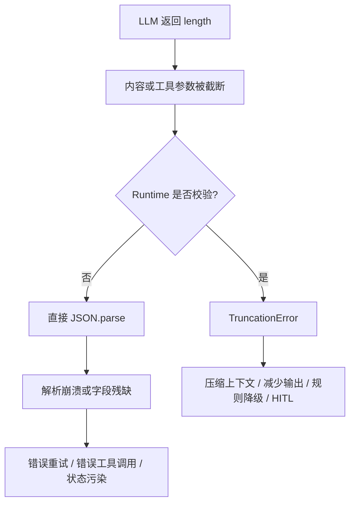
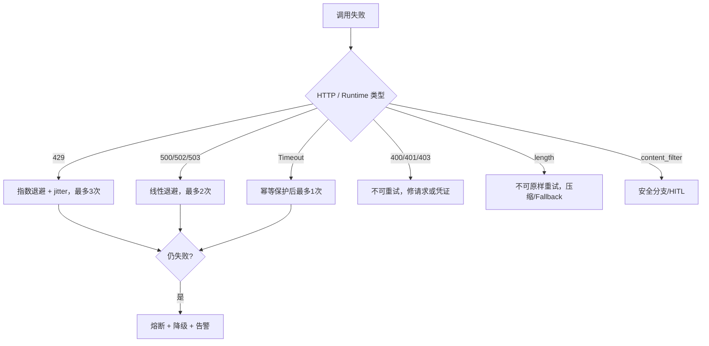

# finish_reason 与 Retry 决策

## 1. finish_reason 是状态机输入

`finish_reason` 不能只判断是否等于 `stop`，正确处理如下：

| finish_reason | Runtime 动作 | 是否原样重试 |
|---|---|---:|
| `stop` | 校验并解析普通内容 | 否 |
| `tool_calls` | 校验工具名、JSON 参数、权限与幂等键 | 否 |
| `length` | 抛 `TruncationError`，禁止解析残缺内容 | 否 |
| `content_filter` | 进入安全拒绝或人工处理分支 | 否 |
| `null/unknown` | 抛协议异常并记录原始响应元数据 | 否 |

重要修正：`tool_calls` 是 Agent 的正常终止状态，不是截断错误。

## 2. 为什么 length 是生产事故

对 OTA 场景，残缺参数不能进入工具执行层。即使 JSON 碰巧可解析，也必须经过 Schema、权限、风险和幂等校验。

## 3. Retry 分类决策表

| 错误码/场景 | 是否重试 | 策略 | 理由 |
|---|---:|---|---|
| 429 Rate Limit | 是 | 指数退避 1s/2s/4s，加 jitter，最多3次 | 临时限流 |
| 500/502/503 | 是 | 线性退避 1s/2s，最多2次 | 服务端瞬时故障 |
| 400 Bad Request | 否 | 修正请求 | 同样参数重试必败 |
| 401/403 | 否 | 告警并检查凭证/权限 | 鉴权问题 |
| `finish_reason=length` | 否 | 上下文压缩或规则 Fallback | 原样重试仍会截断 |
| `content_filter` | 否 | 安全分支/HITL | 不是可用性故障 |
| 超时 >30s | 是 | 最多1次，短退避并检查幂等 | 可能是网络抖动 |

“不可重试”指禁止原样重放。`length` 可以通过缩短上下文、降低输出上限或拆分任务形成一个新请求，但这属于恢复策略，不是 Retry。

## 4. Retry 决策流

## 5. 503 一直失败怎么办

1. 第一次失败等待约 1 秒。
2. 第二次失败等待约 2 秒。
3. 重试耗尽后停止请求风暴。
4. 熔断该 Provider。
5. 路由到备用模型或规则引擎。
6. 保留 request ID、错误类型、重试次数和延迟。
7. 高风险任务转 HITL，不自动执行 OTA。

