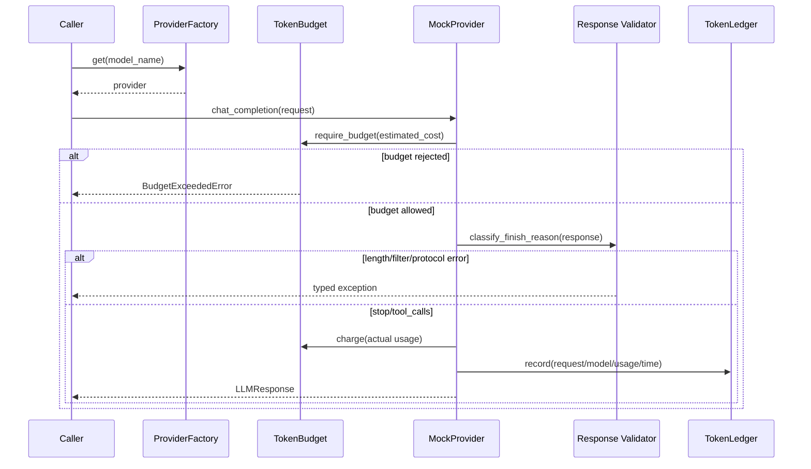

# 11:00-12:00 LLM 调用层基础设计

## 1. 已实现模块

| 模块 | 职责 |
|---|---|
| `app/schemas/llm.py` | `LLMRequest`、`LLMResponse`、`TokenUsage` |
| `app/core/llm_provider.py` | Provider ABC、MockProvider、Factory |
| `app/core/token_budget.py` | 内存预算、Pre-check、扣费、Ledger |
| `app/core/finish_reason.py` | 响应状态分类 |
| `app/core/retry_policy.py` | Retry 决策表代码化 |

## 2. 调用时序



## 3. 关键边界

- 预算在 Provider 调用前检查。
- 预算等于上限时也拦截，保留最小运行余量。
- `length` 在记账和 Ledger 之前抛错；真实 Provider 中 API 已产生费用，因此生产实现仍需记录失败 usage。本 Mock 用于验证控制流，不代表供应商不计费。
- Ledger 当前为内存实现，进程重启会丢失，只用于 Phase 0。
- 未接入真实 DeepSeek/Qwen API。

## 4. 与 Day 1 的衔接

Day 1 用 Pydantic 保护业务输入；Day 2 用 Pydantic 统一模型请求与响应。两层边界分别保护：

```text
业务请求 -> Day 1 Schema -> LLMRequest -> Provider
Provider Response -> LLMResponse -> finish_reason 状态机 -> 后续 Agent
```

