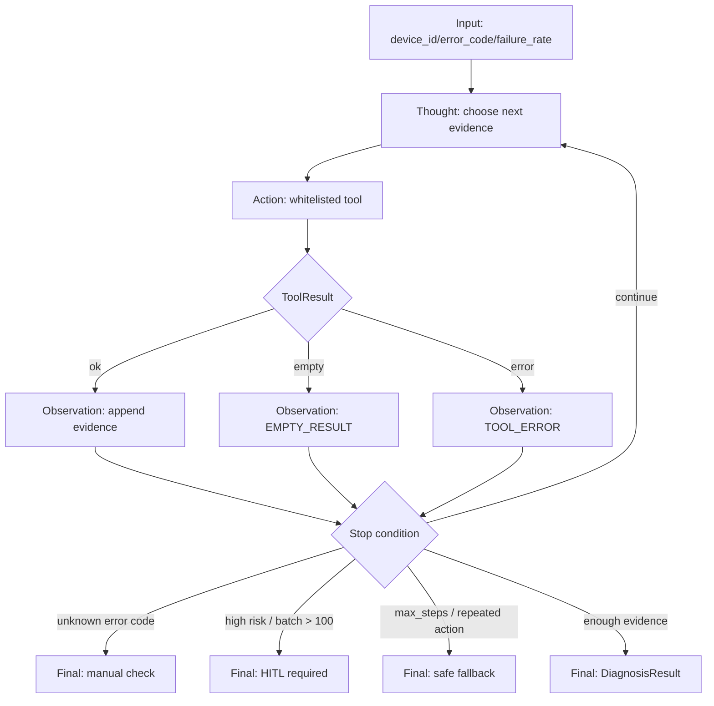

# Day 03 ReAct 准确率报告

## 验证范围

今天实现的是规则版最小 ReAct 状态机，不接真实 LLM、不做 RAG、不接 Qdrant、不用 LangGraph。

验证链路：

```text
Input
-> Thought: 规则选择下一步证据
-> Action: 只调用 ToolRegistry 白名单工具
-> Observation: 记录工具结果、空结果或异常
-> Final: 返回 DiagnosisResult
```

## Mermaid 状态机图



## 10 条 TMS 样例结果

| # | 场景 | 期望 | 当前结果 | 是否命中 |
|---:|---|---|---|---:|
| 1 | `OTA_TIMEOUT` + `failure_rate=0.08` | 灰度/重试，风险 MEDIUM 或 HIGH | 小批量灰度重试，MEDIUM | 是 |
| 2 | `DEVICE_OFFLINE` | 不建议直接 OTA | 暂缓 OTA | 是 |
| 3 | `FIRMWARE_MISMATCH` | 阻止升级，HITL | HIGH + HITL | 是 |
| 4 | `HIGH_FAILURE_RATE` + `0.12` | 试点，不全量，HITL | HIGH + HITL | 是 |
| 5 | `SCRIPT_EXEC_ERROR` | 沙箱复现，不直接重试 | HIGH + HITL | 是 |
| 6 | `UNKNOWN_CODE` | 不胡编，人工排查 | `UNKNOWN_ERROR_CODE_REQUIRE_MANUAL_CHECK` | 是 |
| 7 | `OTA_TIMEOUT` + 设备离线 | 暂缓操作 | 暂缓远程 OTA | 是 |
| 8 | `failure_rate=0` | LOW 或 MEDIUM，不得 HIGH | LOW/MEDIUM | 是 |
| 9 | `failure_rate=1` | HIGH，必须 HITL | HIGH + HITL | 是 |
| 10 | `batch_size=500` | HIGH 或必须 HITL | HIGH + HITL | 是 |

## 指标

| 指标 | 计算方式 | 当前结果 | 最低线 | 优秀线 |
|---|---|---:|---:|---:|
| 决策准确率 | 命中期望动作样例数 / 总样例数 | 100% (10/10) | 60% | >=70% |
| 幻觉率 | 胡编未知异常码次数 / 未知异常码样例数 | 0% (0/1) | 0% | 0% |
| 拒绝率 | 对未知/危险操作正确拒绝次数 / 应拒绝次数 | 100% (5/5) | >=80% | 100% |
| HITL 触发准确率 | 正确触发 HITL 次数 / 应触发 HITL 次数 | 100% (5/5) | >=80% | >=90% |

## pytest 结果

```text
14 passed in 0.07s
```

根目录跨日验证：

```text
Day 1: 25 passed, 1 warning
Day 2: 31 passed
Day 3: 14 passed
```

## 30 秒面试话术

我今天手写实现了一个不依赖 LangGraph / LangChain 的规则版 ReAct 状态机。
它解决的是生产级 Agent 中“模型直接回答不可控、工具调用不可追踪、异常处理不可测试”的问题。
如果没有这个机制，TMS 智能运维 Agent 可能跳过设备状态查询、误判异常码、直接建议高风险 OTA 操作。
我的方案是把流程拆成 Thought、Action、Observation、Final，并加入 `max_steps=6`、工具白名单、重复 Action 终止、未知异常码兜底、高风险 HITL、工具异常转 Observation。
这个方案的权衡是它暂时不够智能，但非常可控、可测、可审计。
今天我用 10 条 TMS 异常样例评估，决策准确率是 100%，HITL 触发准确率是 100%，幻觉率是 0%。
最终它为后续接入 RAG、Checkpoint、Retry、Circuit Breaker 和 DLQ 打下了 Agent Runtime 底座。

## Git

```text
Message: phase0-day3 manual react state machine
Commit ID: 以 git log -1 为准
```
