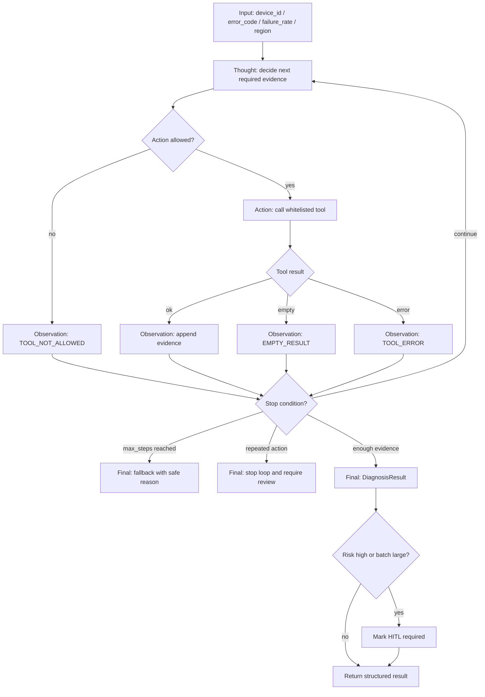

# Day 03 Transformer / KV Cache / ReAct 原理笔记

时间：08:00 - 11:00  
主题：Transformer Attention、KV Cache、规则版最小 ReAct 状态机  
边界：今天不接真实 LLM，不做 RAG，不用 LangGraph，只为手写 ReAct 状态机建立原理基础。

## 1. 08:00-09:00 Attention 解决什么问题

模型生成当前 token 时，不能只看最后一个 token，也不能平均看所有历史 token。它必须判断：当前这一步最应该关注上下文里的哪些 token。

Attention 解决的就是“相关性分配”问题。它给上下文中的每个 token 一个权重，让模型在生成当前 token 时，把更多注意力放在更相关的位置上。

例如 TMS 诊断输入：

```text
设备 TMS-GD-001 报 OTA_TIMEOUT，近 7 天失败率 0.18，当前离线，区域华南。
```

当模型生成“建议动作”时，应该重点关注：

- `OTA_TIMEOUT`：决定异常知识和处置路径。
- `失败率 0.18`：影响风险等级。
- `当前离线`：影响是否允许远程 OTA。
- `区域华南`：影响后续检索和运维上下文。

如果没有 Attention，模型无法在长上下文中动态判断哪些信息更重要。

## 2. Q / K / V 用自己的话解释

Transformer 会把每个 token 的向量映射成三种角色：Query、Key、Value。

| 名称 | 直觉解释 | 在 Attention 中的作用 |
|---|---|---|
| Q, Query | 当前 token 发出的“我要找什么信息”的问题 | 用来和所有 Key 做匹配 |
| K, Key | 历史 token 暴露出的“我是什么信息”的索引 | 被 Query 匹配，决定注意力权重 |
| V, Value | 历史 token 真正提供给模型使用的内容 | 按注意力权重加权汇总 |

更口语化地说：

- Q 是当前生成位置的搜索请求。
- K 是上下文中每个位置的检索标签。
- V 是上下文中每个位置真正可取出的内容。

当前 token 的 Q 会和历史 token 的 K 做相似度计算。相似度越高，说明当前 token 越应该关注那个历史位置。得到权重后，再按权重把对应的 V 加权求和，形成当前步骤真正使用的上下文信息。

## 3. Transformer 注意力公式

标准缩放点积注意力公式：

```text
Attention(Q, K, V) = softmax((QK^T) / sqrt(d_k)) V
```

拆开看：

1. `QK^T`：当前 Query 和所有 Key 做相似度计算。
2. `/ sqrt(d_k)`：缩放，避免维度过大时分数过大，导致 softmax 过于尖锐。
3. `softmax(...)`：把相似度转成注意力权重，所有权重和为 1。
4. `... V`：用权重加权 Value，得到当前 token 的上下文表示。

面试表达：

> Attention 的本质不是“模型在思考”，而是当前生成位置用 Query 去匹配上下文的 Key，再按权重读取 Value。它解决的是长上下文中信息选择和相关性分配的问题。

## 4. 09:00-10:00 KV Cache 缓存的是什么

自回归生成时，模型一次只生成一个新 token。生成第 `t` 个 token 时，前面 `1...t-1` 的历史 token 已经固定，不会再变。

如果每生成一个新 token，都重新计算所有历史 token 的 Key 和 Value，就会产生大量重复计算。

KV Cache 缓存的就是历史 token 的 Key / Value：

```text
step 1: 计算 token_1 的 K/V，写入 cache
step 2: 只计算 token_2 的 Q/K/V，复用 token_1 的 K/V
step 3: 只计算 token_3 的 Q/K/V，复用 token_1..2 的 K/V
...
```

这样每一步只需要为新 token 计算新的 K/V，历史部分直接从 cache 读取。

## 5. 为什么不缓存 Q

Q 来自当前生成位置，代表“这一步要找什么信息”。每生成一个新 token，当前位置都会变化，所以 Q 也会变化。

K/V 来自历史上下文。历史 token 一旦生成完成，它们对应的 K/V 就稳定了，后续步骤可以复用。

因此：

- 缓存 K/V 有意义，因为历史上下文稳定。
- 不缓存 Q，因为 Q 是当前步骤的新查询，每一步都不同。

面试表达：

> KV Cache 缓存历史 token 的 Key 和 Value，因为历史 token 不再变化；不缓存 Query，因为 Query 属于当前生成位置，每一步都要重新产生。

## 6. KV Cache 如何减少重复计算

没有 KV Cache：

```text
生成第 1 个 token：计算 1 个位置的 K/V
生成第 2 个 token：重新计算 1..2 的 K/V
生成第 3 个 token：重新计算 1..3 的 K/V
...
```

有 KV Cache：

```text
生成第 1 个 token：计算 token_1 的 K/V，缓存
生成第 2 个 token：只计算 token_2 的 K/V，复用 token_1
生成第 3 个 token：只计算 token_3 的 K/V，复用 token_1..2
...
```

它加速的是推理阶段的自回归生成，尤其是长上下文、多轮对话和长输出场景。

工程结论：

> KV Cache 不是减少模型参数量，也不是减少 Attention 机制本身，而是避免每一步重复计算历史 token 的 Key/Value。

## 7. KV Cache 的工程代价

KV Cache 提升推理速度，但会换来显存和调度成本。

### 7.1 显存代价

每个历史 token 都要保存每层 Transformer 的 K/V。层数越多、hidden size 越大、并发越高，缓存越大。

近似关系：

```text
KV Cache 显存 ∝ batch_size × sequence_length × layers × kv_heads × head_dim
```

所以 KV Cache 不是免费的。长上下文和高并发会直接推高显存占用。

### 7.2 上下文长度代价

上下文越长，需要缓存的历史 K/V 越多。

这会带来三个后果：

- 首 token 延迟变高，因为长 prompt 仍然需要先处理。
- 后续生成占用更多 KV Cache。
- 在显存固定时，可承载的并发数下降。

因此扩大上下文窗口不能替代检索质量，也不能替代上下文压缩。

### 7.3 并发代价

每个并发请求都有自己的 KV Cache。并发请求越多，总 KV Cache 越大。

生产上常见问题：

- 高峰期显存被 KV Cache 打满。
- 长上下文请求挤占短请求资源。
- 大 batch 提升吞吐，但增加单次显存占用。
- 多租户场景需要按任务类型限制最大上下文和最大输出。

面试表达：

> KV Cache 用显存换推理速度。它能减少重复计算，但上下文长度、模型层数和并发都会放大显存占用，所以生产系统必须限制上下文、控制输出长度，并对高并发场景做容量规划。

## 8. 10:00-11:00 ReAct 是状态机，不是 Prompt

ReAct 的核心不是让模型“多写几句思考”，而是把 Agent 执行拆成可控状态：

```text
Thought -> Action -> Observation -> Thought -> ... -> Final
```

每一步都有明确职责：

| 阶段 | 职责 | 工程风险 |
|---|---|---|
| Thought | 判断下一步应该做什么 | 可能幻觉、跳过证据、循环 |
| Action | 选择工具和参数 | 可能误调工具或传错参数 |
| Observation | 接收工具结果或错误 | 可能空结果、异常、脏数据 |
| Final | 输出结构化结论 | 可能缺证据、风险判断错误 |

生产级 ReAct 必须把这些阶段变成状态机，而不是自由文本。

## 9. ReAct 状态流转图



今天的规则版 ReAct 不接真实 LLM。Thought 由规则逻辑实现，Action 从工具白名单中选择，Observation 记录工具结果，Final 返回 `DiagnosisResult`。

## 10. Day 3 为什么先手写，不先上 LangGraph

Day 3 的目标是掌握状态流转、工具调用、终止条件和测试评估。直接上 LangGraph 会让框架替我们隐藏关键细节。

先手写的原因：

1. 必须能解释 `Thought -> Action -> Observation -> Final` 的状态转移。
2. 必须自己设计 `max_steps`，否则无法证明能防死循环。
3. 必须自己实现工具白名单，否则无法说明工具权限边界。
4. 必须自己处理工具异常，否则不知道失败应崩溃、重试还是转 Observation。
5. 必须自己实现重复 Action 检测，否则模型或规则可能卡在循环里。
6. Phase 0 是生存筛选，不是 P1 平台化工程。

LangGraph 可以是后续 P1 或更复杂编排的选择，但 Day 3 必须先把最小状态机写明白、测清楚。

面试表达：

> 我不是不用 LangGraph，而是在 Day 3 不先用。因为今天要验证的是 ReAct 的控制边界：最大步数、工具白名单、重复动作终止、异常转 Observation 和 HITL。框架可以以后引入，但工程师必须先能解释没有框架时状态机如何安全运行。

## 11. 为什么 TMS 异常诊断适合做 ReAct 场景

TMS 异常诊断天然不是一步回答问题，而是一个逐步取证过程。

例如 `OTA_TIMEOUT`：

1. 先识别异常码。
2. 查询设备是否在线。
3. 查询知识库里的异常解释。
4. 根据失败率评估风险。
5. 判断是否允许自动建议 OTA 或必须 HITL。
6. 输出结构化诊断结果。

这正好匹配 ReAct：

```text
Thought: OTA_TIMEOUT 需要先确认设备在线状态
Action: query_device_status(device_id)
Observation: device offline
Thought: 离线设备不能远程 OTA
Action: lookup_error_knowledge(OTA_TIMEOUT)
Observation: OTA 下载或安装超时
Thought: failure_rate=0.18 且设备离线，风险偏高
Final: 暂缓 OTA，建议人工巡检，require_hitl=true
```

TMS 的优势是：

- 异常码有明确知识表。
- 工具调用可以 Mock。
- 风险规则可以显式写出。
- 高风险操作如 OTA、脚本、重启需要 HITL。
- 结果可以用准确率、幻觉率、拒绝率、HITL 触发准确率评估。

## 12. 面试攻击点

### 12.1 Attention 里的 Q、K、V 分别是什么？

Q 是当前生成位置提出的查询，表示“我现在要找什么信息”。K 是上下文每个位置的索引标签，表示“我这里有什么信息”。V 是上下文每个位置真正提供的内容。Q 和 K 算相似度得到注意力权重，再用权重加权读取 V。

### 12.2 KV Cache 为什么能加速推理？

自回归生成时历史 token 不变，所以它们的 K/V 可以复用。KV Cache 把历史 token 的 Key 和 Value 缓存起来，后续每生成一个新 token，只计算新 token 的 K/V，再复用历史 K/V，避免重复计算历史上下文。

### 12.3 KV Cache 会带来什么工程代价？

KV Cache 用显存换速度。上下文越长、并发越高、模型层数越多，缓存越大。生产上必须控制上下文长度、最大输出、并发和 batch，否则显存会被长上下文请求打满。

### 12.4 ReAct 和普通 Prompt Chain 有什么区别？

普通 Prompt Chain 更像固定文本流水线，输入输出主要靠提示词约束。ReAct 是状态机，每一步都有 Thought、Action、Observation 和 Final，能显式控制工具调用、观察结果、终止条件、异常处理和安全边界。

### 12.5 为什么不用 LangGraph？

Day 3 的目标不是搭复杂编排框架，而是掌握 ReAct 最小控制面。先手写能暴露关键工程问题：工具白名单、最大步数、重复 Action、工具异常、未知异常码、HITL。等这些边界可解释、可测试后，再考虑框架才不会被框架牵着走。

### 12.6 ReAct 如何防止死循环？

最小策略包括：

- `max_steps=6`，超过步数直接安全终止。
- 记录 `actions`，同一 Action 连续重复 2 次就终止。
- 工具返回空结果时转 Observation，不继续盲目调用。
- 未知异常码不猜测，直接人工排查。
- Final 必须有结构化输出，不能无限 Thought。

### 12.7 工具执行失败后，Agent 应该崩溃、重试还是转成 Observation？

Day 3 规则版 ReAct 中，工具异常应该转成 Observation，而不是让 Agent 崩溃。是否重试要看错误类型和幂等性；今天不做复杂 Retry，只记录 `ToolResult(ok=False, error=...)`，让状态机根据 Observation 决定 fallback、HITL 或安全终止。

面试表达：

> 工具失败不是 Python 异常泄露给用户，而是 Agent 状态机的一次 Observation。只有这样，后续才能做 Retry、Fallback、Checkpoint 和审计。

## 13. 今日必须形成的一句话技术判断

在生产级 Agent 系统中，ReAct 不是 Prompt，而是状态机；不能依赖模型自由发挥，因为它可能死循环、误调工具或跳过安全判断。我的设计选择是先手写规则版最小 ReAct 状态机，加入工具白名单、最大步数、重复 Action 终止、工具异常转 Observation 和高风险 HITL 标记，代价是代码更重，收益是可控、可测、可审计。

## 14. 11:00 前验收自查

- [x] 能用自己的话解释 Q / K / V。
- [x] 能写出 Attention 公式。
- [x] 能解释 KV Cache 缓存历史 K/V，不缓存 Q。
- [x] 能说清 KV Cache 的显存、上下文长度、并发代价。
- [x] 能画出 `Thought -> Action -> Observation -> Final` 状态流转。
- [x] 能解释为什么 Day 3 先手写，不先用 LangGraph。
- [x] 能把 TMS 异常诊断绑定到 ReAct 状态机。
