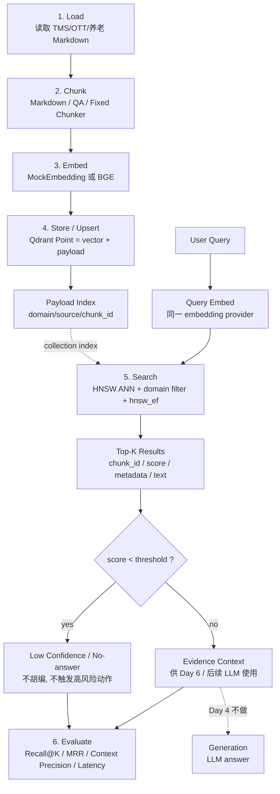

# Phase 0 Day 4 08:00-11:00 原理与面试补齐版

版本：Codex 补齐版  
适用范围：Day 4 上午理论段，08:00-11:00  
合并来源：`rag_full_pipeline_notes.md`、`rag_full_pipeline_notes_cli.md`、`day04_morning_theory_interview_masterclass.md`  
落点：`C:\ai\codex\v20-phase0-survival\day04_rag_pipeline\docs`  

> 本文档用于补齐 Day 4 上午理论交付物。它不替换已有三份笔记，而是把 08:00-09:00、09:00-10:00、10:00-11:00 三个时间块重新整理成“可验收、可复习、可面试攻防”的最终版。  
> 口径统一：所有文档、源码和理论沉淀均由 Codex 负责完成，不再使用“人工手写 / Cursor 辅助”作为真实性表述。本文中的“手写图”指“能在白板上手画并解释的结构图”。

---

## 0. 上午三小时验收表

| 时间 | 主题 | 必须产出 | 本文补齐位置 |
|---|---|---|---|
| 08:00-09:00 | RAG 全链路原理：Indexing -> Retrieval -> Generation | 六阶段流程图，标注 Day 4 边界、离线/在线分界、为什么不做 Generation | 第 1 章 |
| 09:00-10:00 | 向量检索内核：Embedding 空间 / HNSW 索引 / ANN vs KNN | HNSW 分层图，ANN/KNN 对比，`m` / `ef_construct` / `hnsw_ef` 参数笔记 | 第 2 章 |
| 10:00-11:00 | RAG 评估与失效模式：语义鸿沟 / 低分率 / Context Precision | RAGAS 四指标，工程 8 指标，语义鸿沟案例，低分兜底策略 | 第 3 章 |

Day 4 的上午结论：

> 先把 Retrieval 做成可解释、可重复、可评估的基础设施，再谈 Generation。今天不追求“回答得像人”，而是证明系统能稳定召回正确证据，并知道什么时候应该拒答、低置信或转人工。

---

## 1. 08:00-09:00：RAG 全链路原理

### 1.1 RAG 的核心问题：知识、证据和更新速度

LLM 参数内的知识有三个生产缺陷：

- **不可实时更新**：模型训练完成后，参数知识固定；TMS 异常码、OTT CDN 厂商策略、养老健康规范却会持续变化。
- **不可可靠溯源**：模型说出的事实未必能指出来源；工程系统需要 chunk_id、source、score、metadata。
- **不可按领域隔离**：模型不会天然知道当前请求只允许查 TMS，不允许混入 OTT 或养老知识。

RAG 的工程目标不是“让模型更聪明”，而是建立一条外部知识证据链：

```text
query
  -> retrieve(top_k evidence)
  -> return chunk_id/source/score/metadata
  -> later generation must cite or use these evidence
```

在当前 Phase 0 仓库里，Day 4 的 RAG 不接真实 LLM 生成，只交付检索链路：

```text
文档加载 -> 切片 -> Embedding -> Qdrant Upsert -> Search -> Top-K -> 基线评估
```

### 1.2 六阶段流程图：白板可手画版

```text
┌────────────────────────────── Offline Indexing ──────────────────────────────┐
│                                                                              │
│  ① Load              ② Chunk             ③ Embed             ④ Store          │
│  读取原始文档   ->   切成知识单元   ->   生成向量      ->    写入 Qdrant       │
│  Markdown           ChunkPayload         vector[512]        Point             │
│  TMS/OTT/养老        chunk_id/domain      BGE/Mock           vector+payload    │
│                                                                              │
└──────────────────────────────────────────────────────────────────────────────┘
                                      │
                                      │ collection: phase0_day4_context
                                      ▼
┌────────────────────────────── Online Retrieval ──────────────────────────────┐
│                                                                              │
│  ⑤ Retrieve                                                                  │
│  query -> query_vector -> HNSW ANN search -> domain filter -> score threshold │
│                                                                              │
│       output: Top-K RetrievalResult(chunk_id, score, text, metadata)          │
│                                                                              │
└──────────────────────────────────────────────────────────────────────────────┘
                                      │
                                      ▼
┌────────────────────────────── Evaluation / Generation ───────────────────────┐
│                                                                              │
│  ⑥ Evaluate: Day 4 做                                                        │
│     Recall@K / MRR / Context Precision / Low-score Rate / Latency             │
│                                                                              │
│  ⑦ Generation: Day 4 不做                                                     │
│     真实 LLM 回答、Faithfulness、Answer Relevancy 留到后续                    │
│                                                                              │
└──────────────────────────────────────────────────────────────────────────────┘
```

### 1.3 六阶段 Mermaid 图：文档可渲染版



### 1.4 离线 Indexing 与在线 Retrieval 的工程边界

| 维度 | Offline Indexing | Online Retrieval |
|---|---|---|
| 触发频率 | 文档新增、更新、重建 collection | 每次用户查询 |
| 主要目标 | 建库质量、幂等、可追溯 | 低延迟、稳定召回、低噪声 |
| 可接受耗时 | 秒级到分钟级 | 毫秒级到数百毫秒 |
| 核心参数 | chunk_size、overlap、embedding model、`m`、`ef_construct` | top_k、domain filter、score_threshold、`hnsw_ef` |
| 错误后果 | 建库质量差，长期影响召回 | 单次查询低质，可能诱发幻觉 |

关键面试判断：

> `ef_construct` 是离线索引质量参数，慢一点可以接受；`hnsw_ef` 是在线查询参数，每次请求都付延迟成本。它们体现了 Indexing 和 Retrieval 的工程边界。

### 1.5 Day 4 为什么只做 Retrieval，不做 Generation

Day 2 已经证明 LLM 调用层存在成本、截断、finish_reason、合规和 retry 问题；Day 3 已经证明 ReAct 决策必须显式控制工具、观察、终止和 HITL。Day 4 如果直接把 RAG 和 LLM 生成混在一起，会把两个不同风险源混成一个黑盒。

错误定位示例：

| 端到端失败 | 可能原因 | 应归属 |
|---|---|---|
| 答案没有引用 OTA 超时处理建议 | `OTA_TIMEOUT` chunk 没召回 | Retrieval |
| 召回了正确 chunk，但答案编造不存在的设备状态 | Generation / ReAct 约束 |
| 输出 JSON 被截断 | Day 2 finish_reason / max_tokens |
| 高风险 OTA 未触发 HITL | Day 3 safety policy |
| 问“今天天气”却返回 TMS 文档 | Retrieval threshold / no-answer 失败 |

Day 4 的正确验收口径：

```text
query -> top_k chunks -> score -> source metadata -> metrics
```

Day 4 不接受的验收口径：

```text
query -> 自然语言答案看起来还可以
```

### 1.6 RAG 在 Day 3 ReAct 中的位置

Day 3 现在有硬编码知识工具：

```text
lookup_error_knowledge(error_code)
```

Day 4 结束后，它的替代方向是：

```text
retrieve(query="OTA_TIMEOUT 失败率 0.18 华南 Android 11", domain="tms", top_k=5)
```

但替换时必须保留 Day 3 的安全边界：

- unknown error code -> manual check。
- low confidence retrieval -> no hallucination。
- tool failure -> Observation，不让 Agent 崩溃。
- high risk / batch operation -> HITL。
- offline device -> 暂缓远程 OTA。

面试一句话：

> RAG 不是 ReAct 之外的另一套系统，而是 ReAct 的一个证据工具。它改变的是知识来源，不改变安全策略。

---

## 2. 09:00-10:00：向量检索内核

### 2.1 Embedding 空间的直觉

Embedding 把文本变成向量：

```text
"直播卡顿怎么排查？"
  -> [0.0179, 0.0559, -0.0118, ..., 0.0042]
```

语义相近的文本在向量空间中距离更近：

```text
"直播卡顿"             ≈ "播放延迟高"
"设备离线超过72小时"   ≈ "终端长时间无心跳"
"老人头晕"             ≈ "低血压或降压药过量风险"
```

但 embedding 不是魔法，它有边界：

- 短 query 信息量少，向量可能不稳定。
- 领域术语和口语表达可能存在语义鸿沟。
- 编号、版本号、厂商名等精确词可能被稠密向量“模糊化”。

### 2.2 Cosine 相似度与归一化

RAG 文本检索常用 Cosine：

```text
cos(q, d) = (q · d) / (||q|| * ||d||)
```

解释：

- `q` 是 query vector。
- `d` 是 document chunk vector。
- Cosine 关注方向，不关注模长。
- 对文本语义来说，“方向”通常比“向量长度”更有意义。

工程结论：

- Qdrant collection 使用 `Distance.COSINE`。
- BGE embedding 建议 `normalize_embeddings=True`。
- MockEmbedding 也应输出稳定向量，并保证同文本同向量。
- 同一 collection 不能混用不同维度或不同模型。

### 2.3 KNN：精确但不适合生产规模

KNN 暴力搜索：

```python
scores = []
for chunk_vector in all_vectors:
    scores.append(cosine(query_vector, chunk_vector))
return sorted(scores, reverse=True)[:top_k]
```

复杂度：

```text
O(N * d)
```

其中：

- `N` 是向量数量。
- `d` 是向量维度，例如 BGE small zh v1.5 是 512 维。

如果 `N = 1,000,000`，每次查询都要做百万级相似度计算。精确 KNN 可以作为评估上限或小规模测试，但不是生产路径。

### 2.4 ANN：用近似换取延迟可控

ANN 是 Approximate Nearest Neighbor。它不保证数学上 100% 精确最近，但通过索引结构快速找到高概率最近邻。

工程取舍：

| 方案 | 召回 | 延迟 | 适用 |
|---|---|---|---|
| KNN | 精确最高 | 随 N 线性增长 | 小数据、评估、debug |
| ANN / HNSW | 近似，高召回 | 可控，适合大规模 | 生产检索 |

面试话术：

> ANN 是用可控的少量召回损失换数量级延迟收益。生产系统不是追求数学最优点，而是追求 Recall、P99 延迟、内存和成本的平衡。

### 2.5 HNSW 分层图：白板可手画版

```text
                         Entry Point
                             │
Layer 3  稀疏高速层          ● ───────────────────────── ●
                             │                            │
                             ▼                            ▼
Layer 2  中层导航        ● ── ● ───────────── ● ───────── ●
                         │    │               │           │
                         ▼    ▼               ▼           ▼
Layer 1  局部路网    ● ─ ● ─ ● ───── ● ───── ● ─── ● ─── ●
                     │   │   │       │       │     │     │
                     ▼   ▼   ▼       ▼       ▼     ▼     ▼
Layer 0  全量底图    ●-●-●-●-●-●-●-●-●-●-●-●-●-●-●-●-●-●

搜索过程：
1. 从最高层 entry point 开始。
2. 在当前层贪心走向离 query 更近的邻居。
3. 当前层找不到更近点时，下降一层。
4. 到 Layer 0 后维护候选队列，返回 top_k。
```

HNSW 为什么快：

- 上层稀疏图提供长距离跳转，避免从底层逐点扫描。
- 下层稠密图提供局部精确邻域。
- 搜索过程近似“先粗定位，再精定位”。

类比：

```text
Layer 3: 高速公路
Layer 2: 城市快速路
Layer 1: 主干道
Layer 0: 小区道路
```

### 2.6 HNSW 参数笔记：`m`、`ef_construct`、`hnsw_ef`

| 参数 | 作用位置 | 含义 | 调大收益 | 调大代价 | Day 4 起点 |
|---|---|---|---|---|---|
| `m` | 建图 | 每个节点最大连接数 | 图更连通，召回更高 | 内存更大，构建更慢 | 16 |
| `ef_construct` | 建图 | 构建时候选搜索深度 | 图质量更好 | 建库更慢 | 100 |
| `hnsw_ef` / `ef_search` | 查询 | 查询时的候选队列深度 | 召回更高 | 查询延迟更高 | 64 |

必须能说清的区别：

```text
m 和 ef_construct 是离线建图成本；
hnsw_ef 是在线每次查询成本。
```

调参顺序：

1. 先用 `m=16, ef_construct=100, hnsw_ef=64` 建立基线。
2. 如果 Recall@5 低，但延迟还有余量，先提高 `hnsw_ef`。
3. 如果提高 `hnsw_ef` 仍不够，考虑重建 collection 并提高 `m`。
4. 如果 P99 延迟过高，降低 `hnsw_ef` 或收紧 domain filter / top_k。

当前 Qdrant SDK 口径：

```text
collection HNSW config: m, ef_construct
query SearchParams: hnsw_ef
```

不要把 `ef_search` 当成必须写死在 collection 里的参数。它更适合作为查询侧旋钮。

### 2.7 Qdrant Collection 设计图

```text
Collection: phase0_day4_context
│
├── Vector config
│   ├── size: 512
│   └── distance: COSINE
│
├── HNSW config
│   ├── m: 16
│   └── ef_construct: 100
│
├── Payload index
│   └── domain: keyword
│
└── Points
    ├── id: stable point id
    ├── vector: embedding vector
    └── payload
        ├── chunk_id
        ├── domain
        ├── source
        ├── text
        └── metadata
```

Point 示例：

```json
{
  "id": "tms_e1001",
  "vector": [0.0179, 0.0559, -0.0118],
  "payload": {
    "chunk_id": "tms_e1001",
    "domain": "tms",
    "source": "tms_ops_manual.md",
    "text": "E1001 设备离线超过72小时...",
    "metadata": {
      "error_code": "E1001",
      "device_model": "TMS-GD",
      "risk_level": "HIGH",
      "requires_hitl": true
    }
  }
}
```

### 2.8 Payload Filter 是安全边界，不是性能小优化

如果不做 domain filter：

```text
query: "设备离线超过72小时怎么处理？"
错误召回可能包括：
- OTT 离线缓存
- 养老紧急联系
- TMS 设备离线
```

这会污染 Day 3 ReAct 的 Observation。正确顺序是：

```text
先 domain filter，再向量搜索，再 score threshold
```

面试话术：

> Payload filter 是多领域 RAG 的安全隔离边界。TMS、OTT、养老可以共用一个 collection，但检索必须先按 domain 约束候选集合，否则向量相似度会把跨领域近义词混在一起。

---

## 3. 10:00-11:00：RAG 评估与失效模式

### 3.1 为什么评估是 Day 4 的核心交付

RAG 最容易陷入“看起来答得不错”的幻觉。没有评估基线，就无法回答：

- 纯 Dense 检索到底能召回多少？
- Day 5 Hybrid 是否真的比 Day 4 好？
- Reranker 增加的延迟是否值得？
- 哪些 query 因语义鸿沟失败？
- 低分拒答有没有减少错误上下文？

Day 4 必须建立 30 条 query 基线：

```json
{
  "query_id": "tms_001",
  "query": "设备离线超过3天怎么处理？",
  "domain": "tms",
  "expected_chunk_id": "tms_e1001",
  "expected_keywords": ["离线", "72小时", "现场检修"],
  "ground_truth_context": "设备离线超过72小时...",
  "ground_truth_answer": "建议现场检修..."
}
```

注意：

- `ground_truth_answer` 今天不用于 LLM 生成。
- 它用于定义“未来正确答案应由哪些证据支撑”。
- 今日评估重点是检索结果是否命中 `expected_chunk_id` 和关键词。

### 3.2 RAGAS 四指标：概念补齐

RAGAS 把 RAG 评估拆成检索侧和生成侧：

| 指标 | 归属 | 评估问题 | Day 4 处理方式 |
|---|---|---|---|
| Context Precision | 检索侧 | 检索出来的 context 里，有多少是相关的？ | TopK 相关 chunk 占比 |
| Context Recall | 检索侧 | 应该召回的知识，有多少被召回了？ | Recall@K 近似 |
| Faithfulness | 生成侧 | 答案是否忠于 context，没有编造？ | Day 4 不测 |
| Answer Relevancy | 生成侧 | 答案是否回答了 query？ | Day 4 不测 |

四指标白板图：

```text
                 RAG Evaluation
                       │
        ┌──────────────┴──────────────┐
        │                             │
   Retrieval Quality              Generation Quality
        │                             │
  ┌─────┴─────┐                 ┌─────┴─────┐
  │           │                 │           │
Context   Context          Faithfulness  Answer
Precision Recall                         Relevancy

Day 4 实测这边 ────────┘                 Day 4 不做
```

### 3.3 Context Precision：控制噪声证据

定义：

```text
Context Precision@K = TopK 中相关 chunk 数 / K
```

例子：

```text
query: 直播卡顿怎么排查？
Top5:
1. ott_q001 直播卡顿排查        relevant
2. ott_q003 CDN 回源超时        relevant
3. ott_q008 EPG 不更新          not relevant
4. tms_e1002 OTA 超时           wrong domain
5. ott_q004 播放器版本兼容       relevant

Context Precision@5 = 3 / 5 = 0.60
```

为什么重要：

- Recall 只看“有没有召回正确答案”。
- Context Precision 看“TopK 里噪声有多少”。
- 噪声 context 会浪费 token，且可能诱导 LLM 编造。

### 3.4 Context Recall / Recall@K：控制漏召回

Day 4 用 `expected_chunk_id` 近似 Context Recall：

```text
Recall@K = expected_chunk_id 是否出现在 TopK
```

例子：

```text
expected_chunk_id = ott_q001
Top1 = ott_q003 -> Recall@1 = 0
Top3 = [ott_q003, ott_q001, ott_q004] -> Recall@3 = 1
Top5 = includes ott_q001 -> Recall@5 = 1
```

三个 Recall 的含义：

- `Recall@1`：第一眼是否就对。
- `Recall@3`：常用上下文窗口前几段是否有正确证据。
- `Recall@5`：主召回基线，给 reranker / LLM 留机会。

### 3.5 MRR：惩罚“命中了但排太后”

MRR = Mean Reciprocal Rank：

```text
MRR = mean(1 / first_hit_rank)
```

例子：

| query | expected 首次命中排名 | reciprocal rank |
|---|---:|---:|
| q1 | 1 | 1.00 |
| q2 | 2 | 0.50 |
| q3 | 5 | 0.20 |
| q4 | 未命中 | 0.00 |

MRR 比 Recall 更严格，因为它关心正确证据排得够不够靠前。

面试话术：

> Recall@5 命中但 MRR 很低，说明正确证据虽然被召回了，但排在后面。后续 reranker 的价值就是把这种“召回但排序差”的结果拉到前面。

### 3.6 低分率与 No-answer/Fallback

向量库总能找到“最近”的点，但最近不代表相关。无关 query 示例：

```text
今天天气怎么样？
```

错误行为：

```text
仍然返回 5 条 TMS/OTT/养老 chunk，并交给 LLM 生成答案。
```

正确行为：

```json
{
  "results": [],
  "low_confidence": true,
  "fallback_reason": "NO_RELEVANT_CONTEXT"
}
```

低分率：

```text
low_score_rate = score < threshold 的 query 数 / 总 query 数
```

No-answer/Fallback 正确率：

```text
fallback_accuracy = 无关 query 正确 low_confidence 的数量 / 无关 query 总数
```

和 Day 3 的安全边界对应：

- unknown error code -> 不胡编。
- empty retrieval -> 不胡编。
- low score retrieval -> 不触发高风险动作。

### 3.7 语义鸿沟案例：必须记录为 Day 5 靶子

语义鸿沟定义：

> 用户口语化 query 与文档书面化/指标化/术语化表达，在向量空间里没有足够接近，导致纯 Dense 检索召回失败或低分。

核心案例：

| 领域 | 用户 query | 文档表达 | Dense 失败原因 | Day 5 补救 |
|---|---|---|---|---|
| OTT | 直播卡顿怎么排查？ | OTT 播放延迟高、缓冲率上升、CDN 回源超时 | “卡顿”是体感词，“延迟/缓冲率”是指标词 | BM25 命中卡顿/延迟/CDN，Dense 补语义 |
| TMS | 设备没反应怎么办？ | 心跳中断、设备离线超过 72 小时、EMQX 连接断开 | 口语“没反应”太泛 | query 与异常码术语混合检索 |
| 养老 | 老人头晕要不要送医？ | 体位性低血压、降压药过量、跌倒风险 | 症状词与医学原因跨层级 | BM25 命中头晕/低血压，Dense 扩展相关症状 |

Day 4 对语义鸿沟的正确处理：

- 不提前做 Hybrid。
- 不提前做 Query Rewrite。
- 不提前做 Reranker。
- 用 30 条 query 把失败样本记录下来。
- 在 `day04-what-blocked.md` 中列出未命中 query 和原因。

### 3.8 RAG 检索到了但 LLM 幻觉，谁的问题？

分层定位：

```text
if context 没有正确证据:
    Retrieval failure
elif context 有正确证据但 answer 编造:
    Generation faithfulness failure
elif answer 没答 query:
    Answer relevancy failure
elif context 太多噪声:
    Context precision failure
```

面试回答：

> 不能笼统说“RAG 不行”或“模型不行”。先看 TopK 里有没有 ground truth context；如果没有，是检索召回问题。如果有，但答案仍编造，是生成忠实度问题。如果有很多无关 chunk，是 Context Precision 问题。Day 4 单独做 Retrieval 评估，就是为了把这些责任边界拆开。

---

## 4. 面试速记卡

### 4.1 30 秒总述

我今天上午完成的是 RAG 检索层的理论建模，而不是端到端生成。我的拆法是：离线 Indexing 负责 Load、Chunk、Embed、Upsert，在线 Retrieval 负责 query embedding、HNSW ANN search、domain filter、score threshold 和 Top-K 证据返回。Day 4 不做真实 LLM 生成，因为我要先用 30 条 query 建立 Recall@K、MRR、Context Precision、低分率和延迟基线，证明知识能被稳定召回。纯 Dense 的主要风险是语义鸿沟，所以我会先记录失败案例，Day 5 再用 BM25 Hybrid 和 Reranker 做对比提升。

### 4.2 HNSW 30 秒回答

HNSW 是分层小世界图。上层节点少、边长，用来快速粗定位；下层节点多、边密，用来局部精搜。`m` 控制每个节点的连接数，影响内存和召回；`ef_construct` 控制建图质量，影响离线构建速度；`hnsw_ef` 控制查询时候选队列，影响在线召回和延迟。我的基线是 `m=16, ef_construct=100, hnsw_ef=64`，召回不够先调 `hnsw_ef`，因为它不用重建索引。

### 4.3 语义鸿沟 30 秒回答

语义鸿沟是用户口语和文档术语在向量空间里不够接近，比如用户问“直播卡顿”，文档写“OTT 播放延迟高、CDN 回源超时”。纯 Dense 有时能理解，有时会因为 query 太短或术语差距打低分。Day 4 我不急着解决它，而是用评估集把失败 query 记录下来；Day 5 用 Dense + BM25 混合检索补位，Dense 抓语义，BM25 抓关键词和编号。

### 4.4 评估 30 秒回答

Day 4 的评估不是看答案像不像，而是看检索证据对不对。Recall@K 衡量 expected chunk 有没有进 TopK，MRR 衡量正确 chunk 排得靠不靠前，Context Precision 衡量 TopK 里噪声多不多，低分率和 No-answer 正确率衡量系统会不会对无关问题强行召回。Faithfulness 和 Answer Relevancy 是生成层指标，今天不做真实 LLM，所以只理解不实测。

---

## 5. 上午结束前必须补齐的产出清单

### 5.1 08:00-09:00 RAG 全链路

- [x] 能画出 Load -> Chunk -> Embed -> Store -> Retrieve -> Evaluate / Generation。
- [x] 能区分 Offline Indexing 与 Online Retrieval。
- [x] 能解释 Day 4 为什么不做真实 Generation。
- [x] 能说明 RAG 与 Day 3 ReAct 的关系。

### 5.2 09:00-10:00 向量检索内核

- [x] 能解释 Embedding 空间和 Cosine 相似度。
- [x] 能对比 KNN 与 ANN。
- [x] 能画出 HNSW 分层图。
- [x] 能解释 `m`、`ef_construct`、`hnsw_ef`。
- [x] 能说明 Qdrant collection / point / vector / payload。

### 5.3 10:00-11:00 评估与失效模式

- [x] 能解释 RAGAS 四指标。
- [x] 能计算 Recall@K、MRR、Context Precision、低分率。
- [x] 能举出语义鸿沟案例。
- [x] 能说明低分兜底与 no-answer 的价值。
- [x] 能分层定位“检索失败 vs 生成幻觉”。

---

## 6. 今日上午最终判断

Day 4 上午的核心成果不是背会 RAG 名词，而是建立一套能指导下午实现的工程判断：

```text
1. Chunk 决定知识最小语义单元。
2. Embedding 决定语义空间。
3. HNSW 决定大规模检索延迟和召回权衡。
4. Payload filter 决定领域安全边界。
5. score_threshold 决定是否低置信拒答。
6. Recall/MRR/Context Precision 决定能否诚实评估。
7. 语义鸿沟决定 Day 5 为什么必须做 Hybrid。
```

一句话收束：

> Day 4 先做可审计的 Dense Retrieval 基线：把 TMS、OTT、养老文档切成带来源的 chunk，用稳定 embedding 写入 Qdrant，通过 HNSW + domain filter + threshold 返回 Top-K，再用 30 条 query 的指标诚实记录命中、排序、噪声、低分和延迟。只有这个基线成立，Day 5 的 Hybrid/Reranker 和 Day 6 的 ReAct 集成才有可比较的地基。

