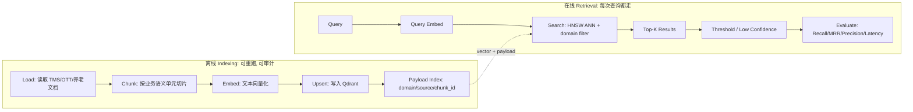

# Phase 0 Day 4 早间原理与面试攻防笔记

版本：Codex 交付版  
范围：08:00-11:00，RAG 全链路原理、Qdrant 向量检索、切片策略、评估体系、面试攻防  
项目路径：`C:\ai\codex\v20-phase0-survival\day04_rag_pipeline`  

> 本文件不覆盖已有 `rag_full_pipeline_notes.md`。它基于 Day 4 融合训练令、Phase 0 项目边界、Day 2 成本治理、Day 3 ReAct 交接，以及当前 Qdrant/BGE 环境准备结论整理。文中不使用“人工手写 / Cursor 辅助”作为来源表述：本轮目标是由 Codex 完成高质量源码和文档产出。

---

## 0. 今日边界：先把 RAG 做成可评估的检索系统

Day 4 的目标不是“做一个会回答问题的机器人”，而是建立一个可重复、可审计、可量化的 **Retrieval Pipeline**：

```text
Load -> Chunk -> Embed -> Upsert -> Search -> Top-K -> Evaluate
```

Phase 0 的硬边界：

- 不做真实 LLM 生成答案。
- 不做 LangChain / LlamaIndex RAG 封装。
- 不做 GraphRAG、Query Rewrite、HyDE、Reranker、多 Agent 或复杂 Context Compression。
- 不改 Day 3 ReAct 核心循环，不把它扩成 LangGraph。
- 空检索、低分检索、未知异常码都不能胡编；高风险处置仍要 HITL。

核心判断：

> 今天先验证“知识能不能被稳定检索出来”。如果检索侧不可量化，后面接 LLM 后无法判断幻觉来自“没有检到证据”，还是“检到了证据但模型没有忠实使用”。

---

## 1. 08:00-09:00：RAG 全链路原理

### 1.1 RAG 解决的不是模型能力，而是知识注入和证据边界

RAG 的全称是 Retrieval-Augmented Generation。它的工程价值不只是“查资料后回答”，而是把 LLM 的上下文从不可控的内隐参数，改成可追踪的外部证据链：

```text
用户问题
  -> 检索相关知识
  -> 只把 Top-K 证据放进上下文
  -> 生成层必须基于证据回答
  -> 输出可追溯 source/chunk_id/score
```

在 V20 Phase 0 里，Day 4 的 RAG 是 Day 6 全链路的证据层：

```text
Day 1 输入校验
  -> Day 4 RAG 检索证据
  -> Day 3 ReAct 决策循环
  -> Mock Tool 查询设备状态
  -> 风险评估 / HITL
  -> DiagnosisResult
```

这意味着 Day 4 的产物必须回答两个问题：

- `query` 能否召回正确 `chunk_id`？
- 检索结果是否带有足够的 `source metadata`，让 Day 6 能解释“这个诊断依据来自哪里”？

### 1.2 离线 Indexing 与在线 Retrieval 是两条流水线



离线侧关注：

- 文档清洗是否丢失关键字段。
- chunk 是否保持一个可回答的完整语义单元。
- embedding 维度和 collection 配置是否一致。
- upsert 是否可重复、幂等、可清理。

在线侧关注：

- query 向量化是否和文档向量使用同一模型。
- domain filter 是否先限制领域，避免 TMS/OTT/养老互相污染。
- score threshold 是否能阻止低分证据撑爆 LLM 上下文。
- top_k 是否足够召回，又不引入太多噪声。

### 1.3 为什么 Day 4 不做 Generation

Day 4 不生成最终答案，是工程上刻意拆分不确定性。

检索侧相对确定：

```text
同一个 query + 同一个 collection + 同一个 embedding model + 同一个 top_k
  -> 结果应该稳定
```

生成侧天然不确定：

```text
temperature / prompt / 模型版本 / 上下文顺序 / safety filter
  -> 都可能改变答案
```

如果今天同时接真实 LLM，一旦答案错误，会出现四种无法区分的责任来源：

| 失败现象 | 可能原因 | Day 4 是否应处理 |
|---|---|---|
| 答案缺关键步骤 | 正确 chunk 未召回 | 是 |
| 答案引用错领域 | domain filter 缺失 | 是 |
| 答案有证据仍胡编 | LLM faithfulness 问题 | 否 |
| 答案截断或格式坏 | Day 2 finish_reason / token budget 问题 | 否 |

所以 Day 4 的验收口径必须是：

```text
query -> top_k chunks -> score -> source metadata -> metrics
```

而不是：

```text
query -> 看似自然的答案
```

### 1.4 Day 4 与 Day 3 ReAct 的衔接

Day 3 目前有硬编码知识库：

```text
lookup_error_knowledge(error_code)
  -> root_cause
  -> recommended_action
  -> default_risk
```

Day 4 建好的接口未来应该替换这个工具的数据来源，但不能改变 Day 3 的安全边界：

- 未知异常码不能编造根因。
- 检索为空要返回 `low_confidence` 或空证据。
- 低分证据不能直接触发 OTA、脚本、重启等高风险建议。
- HIGH 风险或批量操作继续 HITL。
- 工具异常要转 Observation，而不是让 Agent 崩溃。

---

## 2. 09:00 前半：Chunk 策略是 RAG 的第一性问题

### 2.1 Chunk 不是“把文本切短”，而是定义最小可回答单元

Chunk 设计的核心不是长度，而是 **answerability**：

> 一个 chunk 被召回后，是否包含足够信息让系统回答该 query，并且能解释答案来源。

坏 chunk 的典型形态：

| 类型 | 现象 | 后果 |
---|---|---|
| 太碎 | 只切到“现象”，没有“处理建议” | Agent 检到证据仍无法决策 |
| 太大 | 一个 chunk 混入多个异常码/多个 FAQ | score 虚高，Context Precision 降低 |
| 无 metadata | 找到文本但不知道来源 | Day 6 无法解释证据 |
| 切断数字/禁忌 | 血压范围、药品剂量被断开 | 高风险领域错误 |

正确 chunk 应该满足：

- `chunk_id` 稳定，可重复生成。
- `domain` 明确：`tms | ott | elderly`。
- `source` 可追溯：文件名、章节、业务编号。
- `text` 包含一个完整知识单元。
- `metadata` 包含过滤与评估字段，例如 `error_code`、`device_model`、`cdn_vendor`、`metric`、`risk_level`。

### 2.2 三种切片策略对比

| 策略 | 核心机制 | 优点 | 风险 | 适用 |
|---|---|---|---|---|
| Markdown / Recursive Chunker | 按标题、段落、列表逐级切 | 保留文档结构 | 实现复杂，标题层级不规范会漏切 | TMS 运维手册 |
| QA Chunker | 一个 Q/A 对一个 chunk | 粒度天然贴近用户 query | 只适合 FAQ 结构 | OTT FAQ |
| Fixed Chunker | 固定长度 + overlap + 句子边界回退 | 简单稳定，适合非结构化文本 | 容易切断语义或引入重复 | 养老健康指南 |

不建议 Day 4 上语义分块：

- 语义分块需要额外 sentence embedding 或聚类。
- 会引入另一个模型依赖和阈值系统。
- Day 4 目标是建立 Dense 检索基线，不应把 chunker 本身变成不可控变量。

### 2.3 TMS：按异常码段落切，确保诊断闭环

TMS 文档的最小语义单元是“一个异常码的完整处置闭环”：

```text
异常码
  -> 现象
  -> 可能原因
  -> 排查步骤
  -> 建议动作
  -> 风险等级 / HITL 要求
```

示例边界：

```text
## E1001 设备离线超过 72 小时
现象：...
排查：...
建议：...
风险：...
```

如果把“现象”和“建议”切到不同 chunk，ReAct 拿到证据后仍无法完成决策；如果把多个异常码塞进一个 chunk，会导致 query `OTA_TIMEOUT` 召回到 `FIRMWARE_MISMATCH` 的建议，触发错误高风险动作。

设计选择：

- chunk_size 目标：约 800-1200 中文字符。
- overlap：小，异常码段落天然完整，不需要大量重叠。
- metadata：`error_code`、`device_model`、`region`、`risk_level`、`requires_hitl`。

### 2.4 OTT：按 Q/A 对切，检索粒度等于回答粒度

OTT FAQ 的知识结构通常是：

```text
Q: 直播卡顿怎么排查？
A: 先检查 CDN 节点、用户带宽、播放器版本、源站码率...
```

一个 Q/A 对就是最小回答单元。把多个 FAQ 合并会造成两个问题：

- `直播卡顿` query 可能被 `EPG 不更新` 的文本稀释。
- top_k 结果里的一个 chunk 同时包含多个答案，Context Precision 虚高但实际不可用。

设计选择：

- chunk_size 目标：约 300-700 中文字符。
- 一个 Q/A 对一个 chunk。
- metadata：`faq_id`、`cdn_vendor`、`player_version`、`metric`、`symptom`。

### 2.5 养老：固定长度加边界保护，避免断开数值和禁忌

养老健康指南不一定有稳定标题层级，常见结构是疾病、指标、用药、应急建议混排。这里 Fixed Chunker 更稳，但必须加边界保护：

- 不在数值范围中间切，例如 `90/60 mmHg`、`140/90 mmHg`。
- 不在药品名与剂量之间切。
- 不在“禁忌 / 立即就医 / 联系社区医生”句子中间切。

设计选择：

- chunk_size 目标：约 500-700 中文字符。
- overlap：50-100 字符，覆盖跨句禁忌。
- metadata：`topic`、`metric_range`、`medication`、`urgency`、`response_time`。

---

## 3. 09:00-10:00：Embedding、ANN 与 HNSW

### 3.1 Embedding 空间：把文本映射为可比较的语义向量

Embedding 模型把文本映射到 `R^d`：

```text
"直播卡顿怎么排查？" -> [0.0179, 0.0559, -0.0118, ...]
```

当前环境验证结论：

- BGE 建议运行在 WSL Python 3.10 环境。
- 当前 Windows `.venv` 是 Python 3.14，不适合安装 PyTorch / sentence-transformers 栈。
- 已验证 `BAAI/bge-small-zh-v1.5` 可在 WSL CPU 环境输出 512 维向量。
- Day 4 单元测试仍应默认使用确定性 `MockEmbedding`，避免模型下载和外部服务影响测试稳定性。

### 3.2 Cosine、Dot、L2 的选择

常见相似度：

| 距离 | 关注点 | RAG 文本检索适配性 |
|---|---|---|
| Cosine | 向量方向 | 最常用，适合语义相似 |
| Dot Product | 方向 + 模长 | 向量已归一化时近似 Cosine |
| L2 | 欧氏距离 | 更适合部分视觉/数值特征 |

Cosine 公式：

```text
cos(q, d) = (q · d) / (||q|| * ||d||)
```

工程规则：

- BGE 输出建议归一化：`normalize_embeddings=True`。
- Qdrant collection 使用 `Distance.COSINE`。
- 同一 collection 内不能混用不同维度或不同 embedding 模型。
- embedding 模型升级意味着需要重建 collection 或版本化 collection。

### 3.3 KNN 为什么不够：精确但无法扩展

暴力 KNN 做法：

```text
for every vector in collection:
    score = similarity(query_vector, vector)
sort all scores
return top_k
```

复杂度：

```text
O(N * d)
```

当 N 是百万级、d 是 512/768/1024 维时，每次 query 都全量扫描不可接受。KNN 的价值是评估基准，不是生产查询路径。

### 3.4 ANN 与 HNSW：用极小召回损失换数量级延迟收益

ANN 是 Approximate Nearest Neighbor。它承认“不一定找到数学上绝对最近的点”，但通过索引结构把查询延迟降到生产可用。

HNSW 的直觉是多层高速路：

```text
Layer 3:        o ------------------------ o
                |                          |
Layer 2:        o -------- o ------------- o
                |          |               |
Layer 1:        o --- o --- o --- o ------- o
                |     |     |     |         |
Layer 0:        o-o-o-o-o-o-o-o-o-o-o-o-o-o-o

搜索路径：顶层长跳粗定位 -> 逐层下沉 -> 底层局部精搜
```

为什么快：

- 上层节点少，能快速跳到目标区域。
- 下层节点多，负责局部精细搜索。
- 查询不是扫描全库，而是在图上维护候选队列。

面试一句话：

> HNSW 类似“向量检索里的跳表 + 小世界图”。上层负责长距离跳转，下层负责精排邻域，用可调候选队列换取召回与延迟平衡。

### 3.5 HNSW 三个参数必须能讲清

| 参数 | 含义 | 调大收益 | 调大代价 | Day 4 建议 |
|---|---|---|---|---|
| `m` | 每个节点最大连接数 | 图更密，召回更高 | 内存更大，构建更慢 | 16 |
| `ef_construct` | 构建索引时的候选深度 | 图质量更好 | 建库更慢 | 100 |
| `hnsw_ef` / `ef_search` | 查询时候选队列深度 | 召回更高 | 查询延迟更高 | 64 |

重要修正：

> 在当前 `qdrant-client` 版本中，`m` 与 `ef_construct` 是 collection HNSW 配置；`ef_search` 更适合作为查询时 `SearchParams(hnsw_ef=64)` 传入。不要把所有参数都误认为 collection 固定项。

生产调参顺序：

1. 先固定 `m=16, ef_construct=100` 建立可用基线。
2. 召回不足时优先调高查询侧 `hnsw_ef`，因为不需要重建索引。
3. 如果高 `hnsw_ef` 仍无法满足召回，再考虑调大 `m` 并重建 collection。

---

## 4. 10:00 前半：Qdrant 数据模型与工程取舍

### 4.1 Qdrant 四个核心概念

| Qdrant 概念 | 类比 | 在本项目中的含义 |
|---|---|---|
| Collection | 表 | `phase0_day4_context` |
| Point | 行 | 一个 chunk 的向量与 payload |
| Vector | 向量列 | BGE/MockEmbedding 输出 |
| Payload | JSON 字段 | domain、source、chunk_id、metadata |

Point 结构：

```json
{
  "id": "tms_e1001",
  "vector": [0.0179, 0.0559, -0.0118],
  "payload": {
    "chunk_id": "tms_e1001",
    "domain": "tms",
    "source": "tms_ops_manual.md",
    "text": "E1001 设备离线超过72小时...",
    "metadata": {
      "error_code": "E1001",
      "risk_level": "HIGH"
    }
  }
}
```

### 4.2 为什么必须建 Payload Index

Day 4 的三类语料放在同一套检索系统里：

- TMS 运维异常码。
- OTT FAQ。
- 养老健康指南。

如果没有 `domain` 过滤：

```text
query: "设备离线超过 72 小时怎么处理"
可能召回：养老紧急联系、OTT 播放离线缓存、TMS 设备离线
```

这会污染 Day 3 ReAct 的观察结果，甚至让 Agent 使用错误领域证据做高风险建议。

因此 `domain` 必须是强 payload 字段，并建 keyword index：

```text
domain = tms | ott | elderly
```

面试回答：

> Payload 过滤不是锦上添花，而是多领域知识库的安全隔离边界。先过滤 domain，再做向量相似度，能减少错误领域召回，也能降低候选搜索空间。

### 4.3 Qdrant vs Chroma / Pinecone / Elasticsearch

| 方案 | 优势 | 局限 | 本项目判断 |
|---|---|---|---|
| Qdrant | 自托管、HNSW 成熟、payload filter 强、Python SDK 清晰 | 需要自己维护服务 | 适合 Phase 0 与未来私有部署 |
| Chroma | 上手快，适合 notebook 原型 | 生产过滤、索引运维弱一些 | 不适合作为面试主线 |
| Pinecone | 托管省运维，能力成熟 | SaaS 依赖、成本和数据边界问题 | 不符合本地 Phase 0 |
| Elasticsearch | BM25 强，工程生态成熟 | 向量检索是后扩展，不是核心原生心智 | Day 5 可借鉴稀疏检索思想 |

当前选择 Qdrant 的原因：

- 本机 WSL 已部署并验证。
- 自托管符合数据边界。
- 支持 HNSW 和 payload filter。
- Day 5 可继续基于同一语料做 dense vs hybrid 对比。

### 4.4 可重复 Collection 配置

Day 4 的 collection 必须可重复创建：

```text
collection_name = phase0_day4_context
vector_size     = 512  # BGE small zh v1.5
distance        = COSINE
hnsw.m          = 16
hnsw.ef_construct = 100
query.hnsw_ef   = 64
payload_index   = domain keyword
```

必须避免：

- 使用 SDK 默认参数但面试说不出索引设置。
- 同一个 collection 混入不同 embedding 维度。
- 把 API Key 写进仓库。
- 测试依赖真实 Qdrant 才能通过。

---

## 5. 10:00-11:00：评估体系与失效模式

### 5.1 为什么“检索效果不错”不是工程结论

RAG 系统必须用指标说话。否则无法比较：

- Dense only 是否比关键词强。
- Day 5 Hybrid 是否真的提升。
- Reranker 是否值得增加延迟。
- 低分兜底是否减少幻觉风险。

Day 4 最小评估对象：

```text
30 条 query
  -> 每条有 expected_chunk_id
  -> 每条有 expected_keywords
  -> 每条有 ground_truth_context
  -> 每条有 ground_truth_answer
```

其中 `ground_truth_answer` 不是为了今天生成答案，而是为了定义“如果未来要回答，正确答案应该基于哪些上下文”。

### 5.2 八个指标的工程定义

| 指标 | 公式 / 判断 | 说明 |
|---|---|---|
| Recall@1 | Top1 命中 expected_chunk_id / 总 query | 首位是否就是正确证据 |
| Recall@3 | Top3 命中 / 总 query | LLM 常用上下文窗口内是否有正确证据 |
| Recall@5 | Top5 命中 / 总 query | Day 4 主召回基线 |
| MRR | 平均 `1 / first_hit_rank` | 惩罚“命中了但排很后” |
| Context Precision | TopK 中相关 chunk 数 / TopK 总数 | 控制噪声证据 |
| No-answer / Fallback 正确率 | 无关 query 是否低置信或空结果 | 防止无关问题诱导幻觉 |
| 低分率 | score < threshold 的 query 比例 | 观察 embedding 与语料匹配质量 |
| 平均检索延迟 | 30 条 query 平均耗时 | 衡量可用性 |

Day 4 基线不应虚构指标。报告必须写真实结果：

```text
Recall@5 = 实测值
平均延迟 = 实测值
失败 query = 列出 query_id 和原因
```

### 5.3 RAGAS 四指标：把检索和生成拆开评估

| RAGAS 指标 | 衡量对象 | Day 4 状态 |
|---|---|---|
| Context Precision | 检索出的上下文有多少是相关的 | 实测 |
| Context Recall | 应召回证据召回了多少 | 用 Recall@K 近似 |
| Faithfulness | 答案是否忠于上下文 | 不测，因为不做 Generation |
| Answer Relevancy | 答案是否回答了问题 | 不测，因为不做 Generation |

面试陷阱题：

> “RAG 检索到了，但 LLM 还是幻觉，是谁的问题？”

回答：

> 先分层。RAG 负责上下文是否召回、召回是否精准；LLM 负责是否忠实使用上下文。检索侧看 Recall@K 和 Context Precision，生成侧看 Faithfulness 和 Answer Relevancy。不能把所有错误都归因到 RAG，也不能用自然语言答案掩盖检索失败。

### 5.4 语义鸿沟：Day 5 Hybrid 的理由

语义鸿沟是 Dense Retrieval 的核心失败模式：

```text
用户 query: 直播卡顿
文档表达: OTT 播放延迟高 / 码率自适应失败 / CDN 回源超时
```

Dense embedding 可能理解“卡顿”和“延迟”相关，也可能因为 query 太短、术语差距、上下文不足而打低分。

三个业务案例：

| 领域 | 用户口语 query | 文档术语 | 风险 |
|---|---|---|---|
| OTT | 直播卡顿 | 播放延迟高、CDN 回源超时 | Dense 低分，召回失败 |
| TMS | 设备死机 | 心跳中断、设备离线超过 72 小时 | 异常码未对齐 |
| 养老 | 老人头晕 | 低血压、降压药过量、跌倒风险 | 症状与医学术语 gap |

Day 5 的方向：

```text
Dense: 语义泛化
Sparse/BM25: 词面精确命中
Fusion: RRF 或加权融合
Reranker: 最后重排 Top-N
```

Day 4 要做的是记录失败，而不是提前把 Day 5 做掉。

### 5.5 低分兜底：可靠性比“强行有答案”更重要

无关 query 示例：

```text
今天天气怎么样？
```

如果系统强行返回 TMS/OTT/养老 chunk，就是错误行为。正确行为：

```json
{
  "results": [],
  "low_confidence": true,
  "fallback_reason": "NO_RELEVANT_CONTEXT"
}
```

这和 Day 3 一致：

- 未知异常码不能胡编。
- 检索为空不能胡编。
- 低质量证据不能推动高风险动作。

---

## 6. 面试攻防：CTO 追问版

### Q1：Chunk size 怎么选？

不是按固定经验值拍脑袋，而是按业务最小语义单元选。

- TMS：按异常码段落切，目标约 800-1200 字，保证现象、原因、排查、建议、风险在同一 chunk。
- OTT：按 Q/A 对切，目标约 300-700 字，因为 FAQ 的回答粒度天然就是一个 chunk。
- 养老：固定长度 + overlap + 句子边界，目标约 500-700 字，避免切断血压数值、药品剂量、禁忌提示。

一句话：

> Chunk size 的本质不是长度，而是 answerability。chunk 被召回后必须足以支撑一个可审计答案。

### Q2：Qdrant 为什么适合这个项目？

因为它同时满足 Phase 0 的四个要求：

- 自托管，数据边界可控。
- HNSW 是原生核心能力。
- Payload filter 强，适合 TMS/OTT/养老 domain 隔离。
- Python SDK 清晰，可手写 collection 配置和评估链路。

对比：

- Chroma 更像原型工具。
- Pinecone 是托管服务，Phase 0 本地验证不需要。
- Elasticsearch 的稀疏检索强，但向量检索不是它的核心心智；Day 5 可以借鉴 BM25。

### Q3：HNSW 的 `m`、`ef_construct`、`ef_search` 怎么调？

回答结构：

```text
m 决定图的连接密度，影响内存、构建速度和召回。
ef_construct 决定建图时搜索深度，影响图质量和建库耗时。
ef_search / hnsw_ef 决定查询时候选队列，影响召回和在线延迟。
```

我的 Day 4 起点：

```text
m = 16
ef_construct = 100
hnsw_ef = 64
```

调参策略：

1. 召回不够先调 `hnsw_ef`。
2. P99 延迟太高就降低 `hnsw_ef` 或优化过滤。
3. 仍不够再重建 collection 调 `m`。

### Q4：为什么纯 Dense 不能解决语义鸿沟？

Dense 把文本压成固定维向量，能捕捉语义相似，但短 query、口语表达、领域术语之间仍可能映射不稳。

例子：

```text
直播卡顿 <-> OTT 播放延迟高
老人头晕 <-> 低血压 / 降压药过量
设备死机 <-> 心跳中断 / 设备离线
```

Day 5 解法：

```text
Dense 负责语义泛化
BM25 负责关键词/术语精确命中
RRF 融合两路排序
Reranker 再做精排
```

### Q5：RAG 和 Fine-tuning 怎么选？

| 维度 | RAG | Fine-tuning |
|---|---|---|
| 解决对象 | 外部知识、事实更新、证据引用 | 行为模式、格式偏好、风格 |
| 更新成本 | 改文档 / 重建索引 | 重新训练或微调 |
| 可追溯性 | 强，能给 source | 弱，知识在参数里 |
| 适用 | TMS 异常码、OTT FAQ、养老指南 | 固定输出格式、专业语气 |

一句话：

> RAG 管知识，Fine-tuning 管行为。知识频繁变化且需要溯源时优先 RAG。

### Q6：128K 长上下文为什么不能替代 RAG？

三个原因：

1. 成本：每次把全量知识塞进 prompt，输入 token 成本线性增长。
2. 延迟：TTFT 会随着上下文变长明显上升。
3. 可靠性：Lost in the Middle 会让模型忽略中间信息，塞进去不等于用得上。

RAG 的价值：

```text
用检索把全量知识压缩成最相关 Top-K
```

长上下文和 RAG 是互补关系：

- RAG 决定放什么进去。
- 长上下文决定能容纳多少证据。

### Q7：为什么不用 LangChain / LlamaIndex？

Phase 0 的训练目标是能解释每个核心决策，不是调包堆功能。

封装框架会隐藏：

- chunk 边界策略。
- HNSW 配置。
- payload filter。
- score threshold。
- fallback 行为。
- 评估指标计算。

Day 4 必须手写这些边界，才能在 Day 6 解释完整链路：

```text
为什么召回这个 chunk？
为什么过滤掉别的 domain？
为什么低分不回答？
为什么高风险需要 HITL？
```

### Q8：Qdrant 断开或 BGE 不可用怎么办？

这是稳定性问题，不是理论问题。

策略：

- 单元测试默认使用 `MockEmbedding` 和 `InMemoryVectorStore`。
- Qdrant 集成测试单独标记，失败时不影响核心逻辑验证。
- BGE 作为真实向量路径，放在 WSL 环境，避免 Windows Python 3.14 兼容问题。
- 检索失败要返回明确错误或 fallback，不允许静默返回假结果。

---

## 7. 08:00-11:00 自测清单

完成早间理论后，必须能脱稿回答：

- [ ] RAG 六阶段是什么，Day 4 覆盖到哪一步？
- [ ] 为什么 Day 4 不做真实 LLM Generation？
- [ ] TMS、OTT、养老为什么使用不同 chunk 策略？
- [ ] HNSW 为什么比 KNN 快？
- [ ] `m`、`ef_construct`、`hnsw_ef` 分别控制什么？
- [ ] Qdrant 的 Collection / Point / Vector / Payload 如何对应本项目？
- [ ] 为什么 `domain` payload index 是安全边界？
- [ ] 语义鸿沟是什么，为什么 Day 5 要做 Hybrid？
- [ ] Recall@K、MRR、Context Precision、No-answer 正确率怎么计算？
- [ ] RAG 检索到了但 LLM 幻觉，如何分层定位？
- [ ] RAG 和 Fine-tuning 怎么选？
- [ ] 为什么 128K 长上下文不能替代 RAG？

---

## 8. 今日一句话技术判断

在生产级 RAG 系统中，纯 Dense Retrieval 不能解决全部语义鸿沟，因为用户口语化 query 与文档领域术语在向量空间里可能不够接近。Day 4 的正确策略是先建立可重复的 Dense 检索基线：用业务语义单元切片、BGE/MockEmbedding 向量化、Qdrant HNSW 与 Payload 过滤召回 Top-K，并用 30 条 query 的 Recall@K、MRR、Context Precision、No-answer 正确率和延迟指标诚实记录失败；Day 5 再引入 BM25 Hybrid 和 Reranker，而不是今天提前堆复杂链路。

---

## 9. 进入 11:00 编码前的工程约束

文件落点必须符合本仓库 Day 4 独立目录规则：

```text
day04_rag_pipeline/
  app/
    __init__.py
    schemas.py
    chunker.py
    embedding.py
    qdrant_client.py
    retriever.py
  data/
    corpus/
    eval/
  tests/
    test_rag_pipeline.py
  docs/
    rag_baseline_report.md
    day04-what-blocked.md
```

注意：融合训练令中的 `app/rag/` 是通用写法；在当前仓库中应修正为 `day04_rag_pipeline/app/`，避免和 Day 1/Day 2/Day 3 的顶层 `app` 包冲突。

实现时的底线：

- 不覆盖已有 `rag_full_pipeline_notes.md`。
- 不把 Qdrant API Key 写进仓库。
- 不让 pytest 依赖真实 Qdrant 或真实 BGE 下载。
- 不虚构评估结果。
- 不把低分或空检索包装成“有答案”。
- 不在 Day 4 实现 Reranker、Hybrid、GraphRAG 或 LLM 生成。

