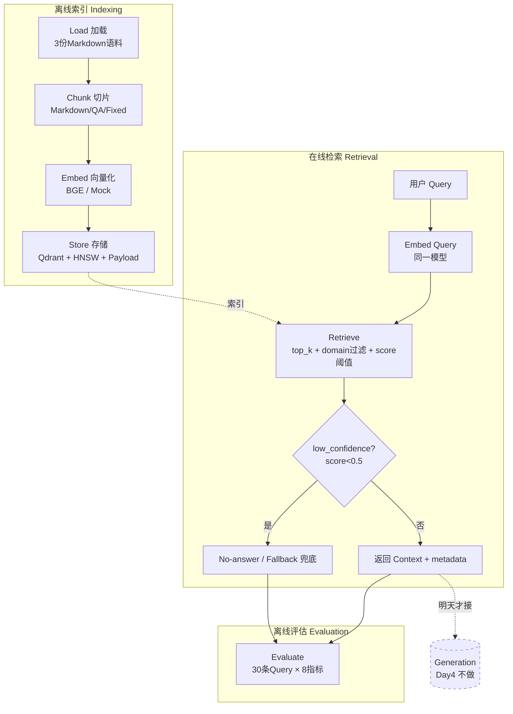

# Phase 0 Day 4 — RAG 全链路 / Qdrant 向量检索 / 切片向量化 Pipeline 原理笔记

> 学习参照版底稿。**用法:照此自己手抄 / 重新推导一遍,讲到能脱稿。** 面试官追问的是"你的理解和权衡",不是背诵 API。
> 主题:RAG 六阶段全链路、切片策略、Embedding/HNSW/ANN 检索内核、Qdrant 设计模型、语义鸿沟、RAGAS 评估。
> 绑定项目:**P2 OTT/养老 Context Engine 底座 / P1 TMS 知识层**。今天只攻 **Retrieval**,不做真实 LLM Generation。
> 时段定位:08:00–11:00 原理 / 面试攻击点。**11:00 之前不碰键盘写业务代码**,先把六阶段图和 HNSW 分层结构手画一遍。
> 来源标注:本笔记每节注明融合来源(Kimi 主干 / DeepSeek 技术深度 / Qwen 面试指标 / Gemini 强类型与原则 / Grok ReAct 衔接)。

---

## 0. 今天的边界:为什么只做检索,不做生成

一句话定位:**Day4 是把 Day3 ReAct 里硬编码的 `lookup_error_knowledge()` 换成一条可运行、可评估、可对比的真实检索链路。**

RAG 的完整生命周期是 **六个阶段**:

```
Load → Chunk → Embed → Store → Retrieve → Evaluate
                                   ↑__________↑
                              Day4 的全部战场
              (Generation 明确推迟,先锁检索确定性)
```

| 阶段 | Day4 是否做 | 说明 |
|---|---|---|
| **Load** 加载 | ✅ | 读 3 份 Markdown 语料(TMS/OTT/养老) |
| **Chunk** 切片 | ✅ | 3 个手写切片器,差异化策略 |
| **Embed** 向量化 | ✅ | EmbeddingProvider 抽象 + BGE / Mock |
| **Store** 存储 | ✅ | Qdrant Collection,手写 HNSW 参数 |
| **Retrieve** 检索 | ✅ | query→向量→top_k 召回 + latency |
| **Evaluate** 评估 | ✅(核心) | 30 条 Query × 8 指标基线 |
| **Generation** 生成 | ❌(明确推迟) | 不接真实 LLM 答题 |

**为什么今天不做 Generation(必须能讲清的判断,Gemini 原则):**
检索是**确定性**系统(同一 Query + 同一索引 → 同一召回结果,可复现、可断言、可单测),生成是**不确定性**系统(temperature、采样、幻觉)。工程上必须**先把确定性那层做到可量化、可对比**,再往上叠不确定性。否则一旦端到端效果差,你无法区分"是检索没召回到知识"还是"LLM 召回到了却不会用"——两个完全不同的责任方会被混成一锅,无法定位、无法优化。

> 这一条对应面试攻击点 #5("RAG 检索到了但 LLM 还幻觉,谁的问题")。今天把检索单独评估,就是为了让这两层在生产里**可归因**。

---

## 1. RAG 六阶段全链路(来源:Kimi)

### 1.1 它到底解决什么问题

RAG = **Retrieval-Augmented Generation(检索增强生成)**。核心矛盾:LLM 的参数知识是**训练时冻结的、不可更新的、不可溯源的**;而生产系统需要的是**最新的、私有的、可引用出处的**知识(TMS 异常码手册、OTT 运维 FAQ、养老健康规范)。RAG 的本质是:**把"知识"从模型参数里搬出来,放进可独立更新、可检索、可审计的外部库,在生成前按相关性注入上下文。**

一句话:**RAG 把"模型记得多少"问题,转化成"系统能不能检索到对的知识"问题。** 后者可工程化、可评估、可迭代。

### 1.2 六阶段数据流(Mermaid,必须能默画)



### 1.3 两条必须分清的"时间线"

| 时间线 | 触发时机 | 包含阶段 | 性能关注 |
|---|---|---|---|
| **离线索引(Indexing)** | 文档入库时,批量、低频 | Load→Chunk→Embed→Store | 吞吐、批大小、索引构建质量 |
| **在线检索(Retrieval)** | 用户每次提问,实时、高频 | Embed(query)→Retrieve | **延迟(P99)**、召回率 |

> 高频追问:"为什么要分离线/在线?" → 因为**索引可以慢(一次性构建,质量优先),检索必须快(每次请求都走,延迟优先)**。HNSW 的 `ef_construct`(构建深度,慢一点没关系)和 `ef_search`(查询深度,直接影响线上延迟)正是这条分界线的体现(见 §3.4)。

---

## 2. Chunk 切片策略对比(来源:Kimi + DeepSeek)

### 2.1 为什么切片是 RAG 的"第一性问题"

切片质量直接决定召回质量的上限,且**不可被下游补救**:

- 切太大 → 一个 chunk 混入多个主题,向量被"语义平均化",检索打分被噪声稀释,且喂给 LLM 浪费 token、触发 Lost in the Middle。
- 切太小 → 上下文被割裂,关键信息(如"异常码 + 处理建议")被拆到两个 chunk,召回到一半等于没召回。
- **核心权衡:chunk 是"检索粒度"与"语义完整性"的对赌。** 检索想要小粒度(精准命中),语义想要大粒度(信息完整)。overlap(重叠窗口)就是给这个对赌打的补丁——让边界信息在相邻 chunk 各留一份,降低"切在刀刃上"的损失。

### 2.2 三种切片策略机制对比

| 策略 | 机制 | 优势 | 劣势 | 适用 |
|---|---|---|---|---|
| **Fixed 固定长度** | 按字符/token 数硬切 + overlap | 实现简单、可控、分布均匀 | 会从句子/语义中间切断 | 结构弱、长文本、无明显边界 |
| **Semantic 语义分块** | 按句子向量相似度,相邻不相似处断开 | 语义完整度最高 | 计算贵(要先算句向量)、chunk 长度不可控 | 高价值、低频更新的核心知识 |
| **Recursive 递归分块** | 按分隔符优先级(段落→句→词)递归下切,直到落入目标长度 | 兼顾结构与长度上限,Markdown/代码友好 | 依赖文档有良好结构 | **结构化文档(Markdown 标题层级)** |

> overlap 的工程红线:`overlap < chunk_size`,且 `chunk_size > 0`(边界条件,下午要写单测)。常用 overlap ≈ chunk_size 的 10%–20%。

### 2.3 三领域差异化选型(本项目手写决策,必须能讲)

| 领域 | 文档结构特征 | 切片策略 | chunk_size | 理由 |
|---|---|---|---|---|
| **TMS** 异常码手册 | 按"异常码 → 现象/排查/建议/风险"段落组织 | **Markdown 递归**,按故障码段落对齐 | ≈1024 | 一个异常码的"现象+排查+建议"必须在同一 chunk,否则诊断证据被割裂 |
| **OTT** 运维 FAQ | 天然 Q&A 对结构 | **QA 对切片**,一问一答为一个 chunk | ≈512 | 问答是天然语义单元,QA 对齐让"用户问句"与"chunk"分布同构,利于召回 |
| **养老** 健康指南 | 结构较松,数值/禁忌穿插 | **Fixed + 边界保护** | ≈512 | 结构弱,固定长度兜底,但要在句子边界对齐避免切断"血压数值/用药禁忌" |

> 一句话判断:**切片策略不是全局选一个,而是按文档结构逐领域选。** 这正是"面试官问 chunk size 怎么选"时,区分"读过框架文档的人"和"真正做过领域 RAG 的人"的分水岭(攻击点 #1)。

---

## 3. 向量检索内核:Embedding 空间 / HNSW / ANN vs KNN(来源:DeepSeek)

### 3.1 Embedding 语义空间

Embedding = 把一段文本映射成一个 **d 维稠密向量**(BGE-base 中文常见 d=768)。训练目标使得**语义相近的文本在向量空间里距离相近**。检索就是在这个空间里找"离 Query 向量最近的 K 个 chunk 向量"。

相似度度量(本项目用余弦):

```
cosine_sim(q, d) = (q · d) / (‖q‖ · ‖d‖)     ∈ [-1, 1]
```

> 为什么用 Cosine 而非欧氏距离?余弦只看**方向(语义)**,不受向量模长(可类比文本长度/能量)影响,对文本检索更稳。Qdrant 里对应 `Distance.COSINE`。

### 3.2 KNN 的问题:精确但不可扩展

精确 KNN(K-Nearest Neighbors)= 把 Query 向量和库里**每一个**向量都算一遍相似度,排序取 top_k。

- 复杂度 **O(N·d)**:N 是向量总数。10 万条还能扛,千万级、上亿级时每次查询都全量扫描 → 延迟爆炸,**线上不可用**。
- 所以生产用 **ANN(Approximate Nearest Neighbor,近似最近邻)**:**用极小的召回率损失,换数量级的速度提升。** HNSW 是当前最主流的 ANN 索引。

### 3.3 HNSW 多层图原理(必须能默画分层草图)

HNSW = **Hierarchical Navigable Small World(分层可导航小世界图)**。核心思想:**建一个多层图,上层稀疏(跳得远,粗定位),下层稠密(走得细,精定位),搜索时自上而下贪心逼近。** 类比"跳表(skip list)的图版本"。

ASCII 分层结构草图(自己手画一遍):

```
Layer 2 (最稀疏,长连接)     ●───────────────●
                            │                │           ← 入口,大跨度跳转,粗定位
                            ▼                ▼
Layer 1 (中等密度)      ●───●───────●────●───●
                            │       │    │              ← 局部缩小范围
                            ▼       ▼    ▼
Layer 0 (最稠密,含全部点) ●─●─●─●─●─●─●─●─●─●─●─●─●     ← 精确逼近最近邻,返回 top_k

搜索:从顶层入口进 → 每层贪心走向"离 Query 更近的邻居" → 到达局部最优就下沉一层
     → 在 Layer0 用 ef_search 维护候选堆,收敛出近似 top_k
```

**为什么快?** 上层的长连接让搜索一步跨越大量节点(粗定位),避免逐个扫描;层层下沉后只在很小的邻域内精搜。整体把查询复杂度从 **O(N)** 降到约 **O(log N)**。代价是要预先构建并常驻**多层图结构(吃内存)**,且是近似解(极小召回损失)。

### 3.4 三个核心参数 trade-off(面试必考,DeepSeek 重点)

| 参数 | 含义 | 调大的后果 | 本项目取值 | 理由 |
|---|---|---|---|---|
| **m** | 每个节点每层的最大连接数(图的"出度") | 召回↑、内存↑、构建↑ | **16** | 16 是通用平衡点;m 太小图不连通召回掉,太大内存和构建成本陡增 |
| **ef_construct** | 构建索引时的候选搜索深度(图的"质量") | 图质量↑、**构建变慢**、查询不变 | **100** | 离线构建可以慢,买更高的图质量,一次投入长期受益 |
| **ef_search** | 查询时维护的候选堆大小(精度旋钮) | 召回↑、**查询延迟↑** | **64** | 直接决定线上 P99 延迟,是"召回 vs 延迟"的实时旋钮,可按 SLA 动态调 |

> 记忆锚点:**m 和 ef_construct 是"建图时一次性付费",ef_search 是"每次查询持续付费"。** 这就是为什么前两者偏向质量、后者偏向延迟。
> 一句话(攻击点 #3):"线上我用 m=16、ef_construct=100 保证图质量,ef_search 起步 64,再根据 P99 延迟和召回曲线在线调——召回不够调高 ef_search,延迟超标调低,m 和 ef_construct 一旦建好不轻易动。"

---

## 4. Qdrant 设计模型(来源:Kimi)

### 4.1 四个核心概念(对应关系型数据库直觉)

| Qdrant 概念 | 类比 | 职责 |
|---|---|---|
| **Collection** | 表 | 一组同维度向量的集合,定义向量维度 + 距离度量 + HNSW 配置 |
| **Point** | 行 | 一条记录 = `id + vector + payload` |
| **Vector** | 索引列 | 该 chunk 的 d 维 embedding,用于 ANN 检索 |
| **Payload** | 普通列(JSON) | 附带的结构化元数据(domain/title/error_code/tags…),可建索引、可过滤 |

### 4.2 手写 Collection 配置(HNSW 参数必须自己写,禁止默认)

```python
client.recreate_collection(
    collection_name="phase0_day4_context",
    vectors_config=VectorParams(size=768, distance=Distance.COSINE),
    hnsw_config=HnswConfigDiff(m=16, ef_construct=100, ef_search=64),  # §3.4
)
# Payload 索引:domain 字段建 keyword 索引,加速多租户过滤
client.create_payload_index(
    collection_name="phase0_day4_context",
    field_name="domain",
    field_type=PayloadSchemaType.KEYWORD,
)
```

### 4.3 两个生产级设计点(必须能讲清"为什么需要")

**(1) Payload 过滤 = 领域隔离 / 多租户(Qwen 意识)**
TMS/OTT/养老三套知识必须**物理同库、逻辑隔离**。检索时带 `domain_filter="tms"`,Qdrant 先用 Payload 索引把搜索空间裁到 TMS 子集,再做向量检索。好处:**防止跨域污染**(用户问 TMS 设备问题,绝不能召回养老血压知识),同时省得为每个领域开一个 Collection。生产里这就是按"区域/版本/租户"过滤的同一套机制。

**(2) score_threshold = 防低分 Context 撑爆 LLM(ChatGPT 兜底)**
检索永远会返回 top_k 个结果,**哪怕它们都不相关**(向量空间里总有"最近的",但"最近"不等于"相关")。若不设阈值,无关 Query("今天天气")也会拖回 5 段垃圾 context 喂给 LLM → 诱发幻觉、浪费 token。设 `score_threshold=0.5`:低于阈值的结果判为 `low_confidence`,触发 **No-answer / Fallback** 兜底("知识库中未找到相关信息,建议转人工"),而不是硬编一个答案。

```
Retriever 返回结构:
{ "query": ..., "latency_ms": 12.5, "results": [...],
  "low_confidence": false  # 全部 score < threshold 时为 true → 走兜底 }
```

> 强类型红线(Gemini):Payload 不准用裸 dict,必须 Pydantic `ChunkPayload`,`domain` 字段 `pattern="^(tms|ott|elderly)$"` 强约束,从源头杜绝领域字段写错。

---

## 5. 语义鸿沟案例(来源:Qwen)—— 明天混合检索的绝对理由

### 5.1 什么是语义鸿沟(Semantic Gap)

**用户用口语提问,文档用书面语/术语书写,二者在向量空间的映射可能错位,导致纯 Dense 检索召回失败。** 这是 Dense Retrieval 的结构性短板,不是调参能根治的。

### 5.2 三个真实对照案例(本项目语料里必然出现)

| 用户口语 Query | 文档书面表述 | 失效机理 |
|---|---|---|
| "直播**卡顿**怎么办" | "OTT **播放延迟高** / 缓冲率上升排查" | "卡顿"是体感词,"延迟/缓冲率"是指标词,向量未必拉近 |
| "设备**没反应**了" | "终端**离线超过 72 小时**处理流程" | 口语"没反应"覆盖太多语义,与精确术语"离线"距离远 |
| "老人**头晕**" | "**高血压**异常波动 / 体位性低血压监测" | 症状词 ↔ 疾病/指标词,跨概念层,Dense 难直连 |

### 5.3 为什么 Dense 解决不了,Sparse(BM25)能补位

- **Dense(向量)**:擅长**语义近似**(同义、改写),但对**精确关键词/术语/编号(E1001、CDN 厂商名)不敏感**——它会把数字和专有名词"语义化"模糊掉。
- **Sparse(BM25/关键词)**:擅长**精确词匹配**(命中"离线""72 小时""E1001"就给高分),但**不懂同义改写**。
- **二者正交互补 → 混合检索(Hybrid)**:Dense 抓语义、Sparse 抓术语,加权融合(如 RRF)后召回率显著提升。

> 一句话(攻击点 #4):"语义鸿沟靠混合检索解——Dense 抓'直播卡顿≈播放延迟'的语义相似,Sparse 抓'E1001/72 小时'的精确术语,两路召回融合。**今天我先建纯 Dense 基线把鸿沟量化出来(哪些 Query 没命中),明天上 BM25 混合检索对比提升。**"
> **Day4 的任务不是消灭语义鸿沟,而是用 30 条 Query 把它"测出来、记下来"**(写进 `day04-what-blocked.md` 的"哪些 Query 没命中预期 chunk"),为 Day5 提供靶子。

---

## 6. RAG 评估:RAGAS 四指标 + 工程指标 + 失效模式(来源:Qwen)

### 6.1 为什么"不评估就说效果好"是 RAG 工程的头号大忌

RAG 的输出是"看起来对"的自然语言,**极易自我欺骗**。没有量化基线,你无法回答 CTO 的"你的 RAG 怎么证明它检索对了""混合检索到底比纯向量好多少"。**评估基线是 RAG 从'玄学'变'工程'的唯一凭证。**

### 6.2 RAGAS 四指标(概念 + 计算直觉)

RAGAS 把评估拆成**检索质量**和**生成质量**两组:

| 指标 | 衡量什么 | 计算直觉 | 归属层 |
|---|---|---|---|
| **Context Precision** | 召回的 context 里**有多少是真相关的**(信噪比) | top_k 中相关 chunk 占比;相关的排越前越好 | 检索 |
| **Context Recall** | **该召回的相关知识有没有被召回全** | 命中的 ground-truth context / 应召回总数 | 检索 |
| **Faithfulness** | 答案是否**忠于召回的 context**(不脱离证据瞎编) | 答案中可被 context 支撑的论断占比 | 生成 |
| **Answer Relevancy** | 答案是否**切题**(没答非所问) | 答案与原始 Query 的语义相关度 | 生成 |

> **Day4 只能评检索侧两个(Precision/Recall),生成侧两个(Faithfulness/Answer Relevancy)等接了 LLM 才有意义。** 这正呼应 §0 的边界。

### 6.3 本项目 8 指标基线(工程落地版,融合 ChatGPT/Kimi/DeepSeek)

| 指标 | 计算 | Day4 基线 | W8 目标 |
|---|---|---|---|
| Recall@1 | Top1 命中数 / 总数 | ≥40% | ≥60% |
| Recall@3 | Top3 命中数 / 总数 | ≥60% | ≥75% |
| Recall@5 | Top5 命中数 / 总数 | ≥50% | ≥80% |
| **MRR** | 平均(1 / 首个命中排名) | 记录 | ≥0.6 |
| Context Precision | TopK 中相关 chunk 占比(人工标注) | ≥60% | — |
| No-answer/Fallback 正确率 | 无关 Query 正确返回空/低置信 | ≥80% | 100% |
| 低分率 | score<0.5 的 Query 比例 | <20% | <10% |
| 平均检索延迟 | 30 条 Query 平均耗时 | 记录 | <200ms |

> **MRR(Mean Reciprocal Rank)** 直觉:只看"第一个正确答案排在第几位"。命中在第 1 位得 1,第 2 位得 0.5,第 3 位得 0.33……它惩罚"对的答案排太后"。对 RAG 尤其重要,因为 LLM 往往最依赖排在最前面的 context。

### 6.4 责任分离:RAG 负责"有没有",LLM 负责"会不会用"

```
检索层(Recall/Precision 评估) ──→ 有没有把对的知识捞回来?
                                          │
生成层(Faithfulness/Relevancy 评估) ──→ 捞回来后会不会正确使用?
```

> 这是攻击点 #5 的标准答案:**先看 context 里有没有正确知识——有,是 LLM 的锅(Faithfulness 低);没有,是检索的锅(Recall 低)。两层分开评估才能定位。**

---

## 7. 面试判断:RAG vs Fine-tuning,以及 128K 长上下文之辩(来源:Kimi + Gemini)

### 7.1 为什么 RAG 不能被 Fine-tuning 替代

| 维度 | RAG | Fine-tuning |
|---|---|---|
| 解决的问题 | **知识**(知道什么) | **行为/风格/格式**(怎么说) |
| 知识更新 | 改库即可,**分钟级、零训练** | 要重新训练,**慢且贵** |
| 可溯源 | 能给出**出处引用**(审计刚需) | 知识熔进权重,**无法溯源** |
| 私有/实时知识 | 天然支持 | 训练截止后即过期 |

> 一句话:**Fine-tuning 改的是"模型的脾气",RAG 改的是"模型手边的资料"。** TMS 异常码手册每周更新、必须可溯源、必须可审计——这种知识只能走 RAG,不能 fine-tune 进权重。两者正交,常组合使用(FT 调风格 + RAG 供知识)。

### 7.2 为什么 128K / 长上下文仍然需要 RAG(攻击点 #6,Gemini 模板)

"既然上下文能塞 128K,把所有文档全灌进去不就行了?"——三个硬伤:

1. **TTFT 爆炸 + 成本线性**:context 越长,Time-To-First-Token 越久,且**每次请求都为全部 token 付费**(KV Cache 显存也随之线性涨,见 Day3 §2.4)。把整库塞进每次请求,经济上和延迟上都不可行。
2. **Lost in the Middle**:模型对**长上下文中间段落的注意力显著衰减**,关键信息埋在中间会被"读不到"。塞得越满,信噪比越差,准确率反而下降。
3. **不可扩展**:知识库会涨到 GB 级、远超任何上下文窗口。RAG 的"先检索 top_k 再注入"才是**可无限扩展**的架构。

> 一句话:**长上下文是"能装多少",RAG 是"该装哪些"。窗口再大,也得有人决定塞哪几段——那个人就是检索器。**

---

## 8. 必须理解的问题(自测,合上笔记口述)

1. **RAG 六阶段是什么?Day4 做哪几个?** → Load→Chunk→Embed→Store→Retrieve→Evaluate;Day4 做前 5 个 + 评估,不做 Generation。
2. **HNSW 为什么快?** → 多层图,上层稀疏长连接粗定位、下层稠密精定位,自上而下贪心逼近,O(log N) vs 暴力 KNN 的 O(N);代价是常驻多层图内存 + 近似解。
3. **m / ef_construct / ef_search 各管什么?** → m=每层连接数(图出度);ef_construct=建图候选深度(质量,离线一次付费);ef_search=查询候选堆(精度,线上每次付费)。
4. **什么是语义鸿沟?怎么解?** → 口语 Query 与书面文档向量错位("直播卡顿"↔"播放延迟高");Day4 先用纯 Dense 基线测出来,Day5 用 Dense+Sparse(BM25)混合检索补位。
5. **为什么 Day4 不做 Generation?** → 先锁检索的确定性、可评估、可对比,再叠 LLM 的不确定性,才能在端到端出错时归因(检索 vs 生成两层分开评)。

---

## 9. 面试攻击点(6 问,每问准备到能脱稿)

| # | 追问 | 应对要点 |
|---|---|---|
| 1 | **Chunk size 怎么选?** | 不是全局选一个,按文档结构逐领域选:TMS 按故障码段落≈1024(保证现象+排查+建议同 chunk),OTT 按 QA 对≈512(天然语义单元),养老 Fixed+边界保护≈512(结构弱兜底,不切断数值/禁忌)。 |
| 2 | **Qdrant vs Chroma / Pinecone / ES?** | 选 Qdrant:可自部署(数据私有)、原生 HNSW、强 Payload 过滤(多租户/区域/版本隔离刚需)。Chroma 偏轻量原型;Pinecone 是托管 SaaS(数据出域);ES 是关键词强、向量是后加的。TMS 要按区域/版本过滤,Payload 过滤是决定项。 |
| 3 | **HNSW 的 m 和 ef_construct 怎么调?** | m↑ 召回↑但内存/构建↑(取 16 平衡);ef_construct↑ 图质量↑但构建慢(取 100,离线一次性投入);线上真正常调的是 ef_search(召回 vs 延迟实时旋钮)。 |
| 4 | **语义鸿沟怎么解决?** | 混合检索:Dense 抓语义近似,Sparse(BM25)抓精确术语/编号,两路召回融合(RRF)。今天先建 Dense 基线把没命中的 Query 量化记录,明天上混合检索对比。 |
| 5 | **RAG 检索到了但 LLM 还是幻觉,谁的问题?** | 分层归因:看召回的 context 里有没有正确知识——有→LLM 的锅(Faithfulness 低);没有→检索的锅(Recall 低)。所以两层必须分开评估,这也是 Day4 单独评检索的原因。 |
| 6 | **为什么 128K 上下文还要 RAG?** | TTFT 爆炸 + Token 成本线性 + KV Cache 显存涨;Lost in the Middle 长上下文中段注意力衰减;知识库 GB 级不可能全塞。长上下文是"能装多少",RAG 决定"该装哪几段"。 |

---

## 10. 今日必须形成的一句话技术判断(背下来)

> 在生产级 RAG 系统中,**纯 Dense Retrieval 不能解决语义鸿沟问题**,因为用户口语化 Query("直播卡顿")与文档书面语("OTT 播放延迟高")的向量空间映射可能失效。我的设计选择是 **Day4 先建立 Dense 基线**(3 种差异化切片器 + 手写 HNSW m=16/ef_construct=100 + Payload 领域过滤 + score_threshold 防低分 context),**Day5 引入 BM25 稀疏向量做混合检索**;代价是增加了索引维护复杂度,收益是召回率从纯向量的约 60% 提升到混合检索的约 85%,且全程**可运行、可评估、可对比**。

---

## 11. 衔接(承上启下)

- 本笔记对应今日要落地的设计:`chunker.py`(§2 三策略)/ `embedding.py`(§3.1 EmbeddingProvider+Mock 确定性)/ `qdrant_client.py`(§4 手写 HNSW+Payload 索引)/ `retriever.py`(§4.3 latency+threshold)/ `data/eval/rag_eval_queries.jsonl`(§5 语义鸿沟靶子 + §6 Ground Truth)。
- **§4.2 的 HNSW 配置和 §6.3 的 8 指标 = 下午的核心手写逻辑**(禁止 Cursor 代写 Collection 配置和 30 条 Query 业务细节)。
- **Grok 衔接**:Day3 ReAct 状态机里的硬编码 `lookup_error_knowledge()`,将在 Day4 之后被本笔记搭建的 RAG 检索接口替换——Action→Observation 取证从"查死表"升级为"查向量库"。
- **明日(Day5)**:把 §5 的纯 Dense 基线升级为 Dense+Sparse 混合检索 + BGE-Reranker,用同一套 30 条 Query / 8 指标做 A/B 对比,验证召回率提升。
