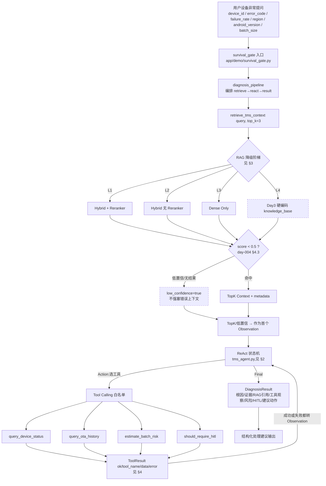
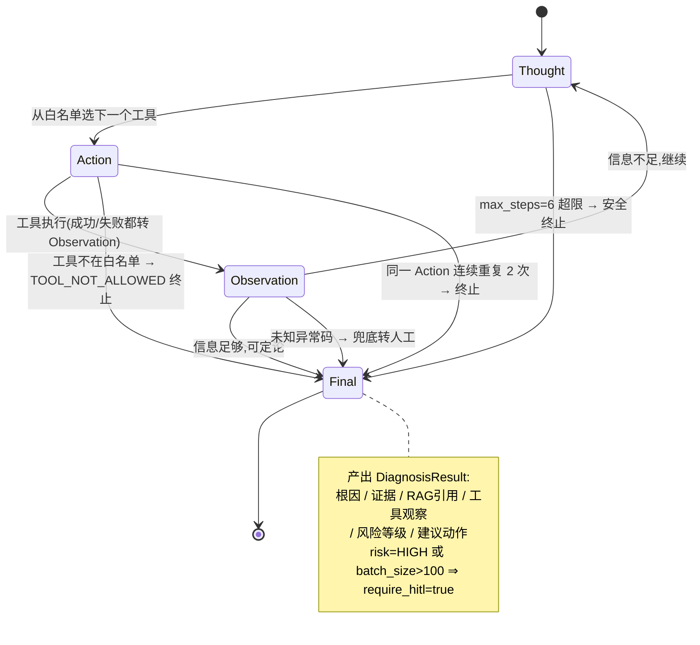
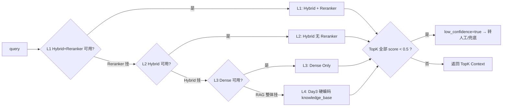

# Phase 0 Day 6 — 通关架构图 / 数据契约(上午 08:40–09:30 Mermaid 草图)

> 本文件是 Day6 通关 Demo 的**设计图与数据契约**,只画结构、定接口,不写实现。
> 下午 14:00 起按本图落地代码。11:00 前红线:不碰业务代码。
> 承接三份笔记:day-003(ReAct 状态机)/ day-004(RAG 检索 + score_threshold 兜底)/ day-005(Hybrid + Reranker + 降级链)。
> 一句话定位:**这不是 Prompt Demo,是最小 Agent Runtime —— 检索 + 状态机 + 工具调用 + 风险判断 + HITL + 失败降级。**

---

## 1. 全链路总图(User Query → RAG → ReAct → Tool → DiagnosisResult)



**五段职责(一句话)**
1. **survival_gate** — 全链路入口与通关裁定,跑 10 条样例。
2. **RAG 检索** — 查 TMS 运维知识,失败按 L1→L4 降级,低分转兜底(不塞错上下文)。
3. **ReAct** — 规则版状态机做决策,带 6 护栏,不接真实 LLM。
4. **Tool Calling** — 白名单工具取证,成功/失败统一转 Observation,绝不崩溃。
5. **DiagnosisResult** — 结构化输出:根因、证据、RAG 引用、工具观察、风险等级、HITL、建议动作。

---

## 2. ReAct 状态机(复用 day-003 §3.2,含 6 护栏)



**6 护栏(下午 tms_agent.py 核心手写,禁止 AI 代写整个循环)**

| 机制 | 规则 | 防的是什么 |
|---|---|---|
| `max_steps=6` | 超过即安全终止 | 死循环 / Token 膨胀 |
| 工具白名单 | 非法名返回 `TOOL_NOT_ALLOWED` | 越权乱调工具 |
| 重复 Action 终止 | 同一 Action 连续 2 次 → 终止 | 原地打转 |
| 未知异常码兜底 | `fallback_reason=UNKNOWN_ERROR_CODE_REQUIRE_MANUAL_CHECK` | 幻觉 |
| 高风险 HITL | `risk==HIGH` 或 `batch_size>100` ⇒ `require_hitl=true` | 跳过安全审批 |
| 工具异常转 Observation | 工具抛错 → `ToolResult(ok=False)` | 不可控崩溃 |

---

## 3. RAG 降级阶梯(承 day-005 降级链 + day-004 §4.3 score_threshold)



| 层级 | 策略 | 触发条件 |
|---|---|---|
| L1 | Best Hybrid + Reranker | 正常优先 |
| L2 | Best Hybrid | Reranker 不可用(→ 可再退 MockReranker) |
| L3 | Dense Only | Hybrid 不可用 |
| L4 | Day3 硬编码知识库 | RAG 整体不可用(Qdrant 挂 → InMemory/硬编码) |

> 降级红线:任何一层返回的 TopK 若全 `score<0.5`,判 `low_confidence`,走兜底,**不强塞低分上下文污染 ReAct**(day-004 §4.3)。
> 领域过滤:检索带 `domain="tms"`,防跨域污染(day-004 §5)—— 对应第 10 条"直播卡顿"必须被挡在 TMS 之外。

---

## 4. 数据契约(三个统一接口,下午照此实现)

### 4.1 `retrieve_tms_context(query, top_k=3) -> dict`
```
{
  "query": "OTA 升级一直超时,Android 11",
  "level_used": "L1",            # L1/L2/L3/L4,记录实际降级层
  "low_confidence": false,       # TopK 全部 score<0.5 时 true
  "latency_ms": 12.5,
  "results": [
    { "section": "OTA_TIMEOUT", "score": 0.82, "text": "...", "domain": "tms" }
  ]
}
```

### 4.2 `ToolResult`(所有工具统一返回,失败不抛到主链路)
```
{
  "ok": true,
  "tool_name": "query_device_status",
  "data": {
    "device_id": "TMS-001", "online": true, "region": "south_china",
    "android_version": "11", "firmware_version": "1.2.3",
    "last_seen": "2026-06-09T10:00:00"
  },
  "error": null                  # ok=false 时填错误码,data 置 null,转 Observation
}
```

### 4.3 `DiagnosisResult`(ReAct 收敛出的最终结构化结果)
```
{
  "root_cause": "OTA 服务端超时 + 弱网重试不足",
  "evidence": ["device online", "last OTA failed: TIMEOUT"],
  "rag_refs": [ {"section": "OTA_TIMEOUT", "score": 0.82} ],
  "tool_observations": [ {"tool": "query_device_status", "ok": true} ],
  "risk_level": "MEDIUM",        # LOW/MEDIUM/HIGH
  "require_hitl": false,         # risk==HIGH 或 batch_size>100 → true
  "recommended_action": "灰度重试,先 5% 试点再全量",
  "fallback_reason": null,       # 未知码/降级时填,如 UNKNOWN_ERROR_CODE_REQUIRE_MANUAL_CHECK
  "react_trace": [ "Thought...", "Action...", "Observation..." ]  # 可审计留痕
}
```

> `react_trace` 是"可解释/可审计"的凭证:每一步 Thought/Action/Observation 留痕,面试与复盘都靠它。

---

## 5. 与笔记的对应关系(不重新发明)

| 本图元素 | 来源 |
|---|---|
| ReAct 状态机 + 6 护栏 | day-003 §3.2–3.3 |
| score_threshold=0.5 低置信兜底 / domain 过滤防跨域 | day-004 §4.3 / §5 |
| Hybrid / RRF / Reranker→Mock 降级 / BM25 保错误码 | day-005 §3–§6 |
| 文件结构 / 工具清单 / DiagnosisResult 字段 | Day6 训练令原文 |
