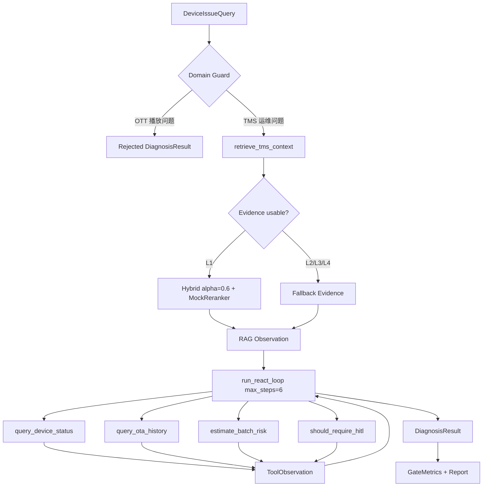

# Day 6 Survival Gate Architecture

生成时间：2026-07-09  
范围：`day06_pass_test/` 内的最小 Agent Runtime 通关实现。

## 1. 实现结论

Day6 已按上午计划落地为一条可运行、可测试、可解释的闭环：

```text
DeviceIssueQuery
-> retrieve_tms_context()
-> run_react_loop()
-> Mock Tool Calling
-> DiagnosisResult
-> GateMetrics
```

实现边界：

- 不接真实 LLM。
- 不接 LangGraph、MCP、Redis、WebSocket、前端或平台化服务。
- 不执行真实 OTA、脚本、重启。
- 不修改 Day1-Day5 基线代码。
- Day6 在本目录内复刻 Day5 最终检索策略：Dense + Sparse + Weighted alpha=0.6 + MockReranker。

## 2. 模块职责

| 文件 | 职责 |
|---|---|
| `app/agent/tms_agent.py` | 定义输入、RAG 证据、工具观察、ReAct trace、DiagnosisResult、GateCase、GateMetrics，并实现 Day3 风格规则版 ReAct 状态机。 |
| `app/agent/fallback_policy.py` | 读取 Day4 TMS 手册，在 Day6 内实现 L1-L4 检索降级和异常码知识兜底。 |
| `app/agent/diagnosis_pipeline.py` | 串联 Query、RAG、ReAct、Tool、Result，定义 10 条通关样例并计算指标。 |
| `app/tools/device_tools.py` | 提供 query_device_status、query_ota_history、estimate_batch_risk、should_require_hitl 四个 Mock 工具。 |
| `app/demo/survival_gate.py` | CLI 入口，运行 10 条样例并输出 JSON 指标。 |
| `tests/test_survival_gate.py` | 固化 10 条样例、通关指标、失败降级和跨域拒绝断言。 |

## 3. Mermaid 流程



## 4. ReAct 护栏

| 护栏 | 落地位置 | 说明 |
|---|---|---|
| `max_steps=6` | `run_react_loop()` | 防止状态机失控。 |
| 工具白名单 | `call_tool()` | 非注册工具返回 `TOOL_NOT_ALLOWED`。 |
| 重复 Action 终止 | `run_react_loop()` | 连续同一 Action 直接安全终止。 |
| 未知异常码兜底 | `run_react_loop()` | 不编造根因，返回人工排查。 |
| 工具异常 Observation | `call_tool()` + `run_react_loop()` | 工具异常返回结构化降级结果。 |
| HIGH/batch HITL | `estimate_batch_risk()` + `should_require_hitl()` | 高风险或 `batch_size>100` 强制人工审批。 |

## 5. 检索降级

| 层级 | 策略 | 触发 |
|---|---|---|
| L1 | Hybrid alpha=0.6 + MockReranker | 正常路径。 |
| L2 | Hybrid alpha=0.6 无 Reranker | Reranker 失败。 |
| L3 | Dense Only | Hybrid 失败。 |
| L4 | Day3 规则知识库 | RAG 空结果或低置信。 |

当前 10 条样例中：

- 8 条使用 L1。
- 1 条强制 RAG 空结果，使用 L4。
- 1 条跨域拒绝，不进入 RAG。

## 6. 为什么不是 Prompt Demo

该实现不依赖一段 Prompt 直接输出答案，而是显式拆成：

- 检索证据：`RAGReference`
- 状态轨迹：`ReactTraceStep`
- 工具观察：`ToolObservation`
- 结构化结果：`DiagnosisResult`
- 真实指标：`GateMetrics`

每一步都可以在 pytest 中断言，也可以在面试中逐步解释。

