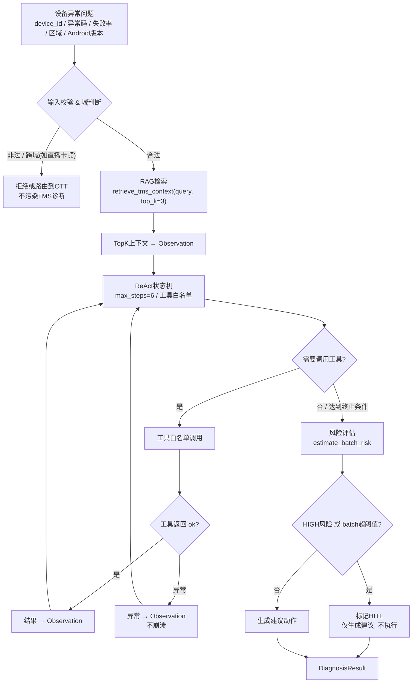
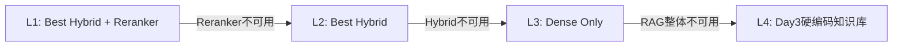

# Day06 Survival Gate 执行计划（Phase 0 通关）

| 项 | 值 |
|---|---|
| 版本 | Phase 0 Day 6 / Sat |
| 主题 | ReAct + RAG + Tool Calling 全链路闭环通关 |
| 本质 | **不是继续开发，是用真实通关测试裁定 Phase 0 是否合格** |
| 上午角色 | Claude Code 出规划草案 → **你审核锁定**（设计判断不外包） |
| 统一入口 | `python -m app.demo.survival_gate` / `pytest -q tests/test_survival_gate.py` |

> 本文是 08:00–11:00 的产出，覆盖：Day1–Day5 集成审查、全链路架构（含 Mermaid）、依赖与接口边界、通关指标定义、失败矩阵、降级策略、面试攻击点、锁定范围。10:20–11:00 由你逐条审核并冻结范围，之后不再加需求。

---

## 0. 今日边界（IN / OUT）

| IN（今天必做） | OUT（今天禁止） |
|---|---|
| 串 Day3 ReAct + Day4 Retriever + Day5 Hybrid 最佳配置 | 加任何新功能 |
| 10 条通关样例 + 真实指标 + 失败复盘 | 调 RAG / 改检索算法 / GraphRAG / Query Rewrite |
| 失败兜底与四级降级 | LangGraph 深集成 / MCP / SSE / P3 / 前端 |
| 通关裁定（通过 / 有条件 / 止损） | 接真实 LLM（规则版闭环即可） |
| 可解释、可审计的 trace | 美化结果、编造指标、隐瞒失败样例 |

**一句话定位**：Phase 0 通关不是证明"我会调模型"，而是证明"我能把 ReAct 状态机、RAG 检索层、工具调用层串成一个可运行、可测试、可解释、可降级的最小 Agent Runtime"。

---

## 1. Day1–Day5 集成审查清单

| 天 | 产物 | Day6 角色 | 是否必接 | 接入方式 | 失败降级 |
|---|---|---|---|---|---|
| Day1 | Pydantic Schema / FastAPI 骨架 | 输入校验参考 | 否 | 仅借用 Schema 定义，**不拉 FastAPI 进主链路** | 直接用 dataclass/字典 |
| Day2 | LLM Client / Token 计费 | 面试解释成本控制 | 否 | **不接真实 LLM**，只在话术里引用 | 无影响 |
| Day3 | ReAct 规则状态机 | 通关核心决策层 | **是** | 主链路决策引擎 | 无可降级——这层挂=不通关 |
| Day4 | Retriever（InMemory / Qdrant） | 知识检索层 | **是** | 提供 TopK 上下文 | 降级到硬编码知识库（L4） |
| Day5 | Best Hybrid + Reranker 配置 | 最佳检索配置 | **是（失败可降级）** | 检索层 L1 首选 | L2→L3→L4 逐级回落 |
| Day6 | Survival Gate | 全链路入口 + 裁定 | **是** | 组装 + 测试 + 裁定 | — |

**红线**：不要为了"完整集成"把 Day1 FastAPI、Day2 真实 LLM、Token Budget 全塞进主链路。今天主目标只有一条链路——`ReAct + RAG + Tool`。多接一层，就多一个今天要 debug 的崩溃点，而它们对通关裁定零贡献。

---

## 2. 全链路架构（Full Chain）

### 2.1 主链路

```
User Query → 输入校验/域判断 → RAG检索 → TopK上下文(Observation)
          → ReAct状态机(工具调用循环) → 风险评估/HITL判定 → DiagnosisResult
```

### 2.2 流程图



### 2.3 数据契约（接口冻结，afternoon 按此实现）

输入：

```python
class DeviceIssueQuery(BaseModel):
    query: str                       # 自然语言问题
    device_id: str
    error_code: str | None = None    # OTA_TIMEOUT / DEVICE_OFFLINE / ...
    failure_rate_7d: float | None = None
    region: str | None = None        # south_china / ...
    android_version: str | None = None
    batch_size: int = 1
```

输出（**可解释、可审计**是通关的硬要求，`react_trace` 支撑"能解释每一步"）：

```python
class DiagnosisResult(BaseModel):
    device_id: str
    error_code: str | None
    root_cause: str                  # 根因
    evidence: list[str]              # 证据（工具观察 + RAG 引用汇总）
    rag_references: list[dict]       # RAG引用: {section, score}
    tool_observations: list[dict]    # 工具观察原文
    risk_level: Literal["LOW", "MEDIUM", "HIGH"]
    requires_hitl: bool              # 高风险是否需人工审批
    recommended_actions: list[str]   # 建议动作
    fallback_path: str               # 命中的降级层: L1/L2/L3/L4/none
    react_trace: list[dict]          # 每步: {step, thought, action, observation}
    status: Literal["ok", "rejected", "degraded"]
```

---

## 3. 依赖关系与接口边界

### 3.1 检索层统一接口

```python
def retrieve_tms_context(query: str, top_k: int = 3) -> dict:
    """
    返回 {"chunks": [...], "fallback_path": "L1|L2|L3|L4", "confidence": float}
    对上层只暴露这一个函数——ReAct 不感知 Hybrid/Reranker/Qdrant 细节。
    好处: 检索实现无论怎么降级, 主链路契约不变。
    """
```

### 3.2 ReAct 状态机契约（Day3 机制**全部保留**，逐条对齐）

| 机制 | 要求 | 通关校验点 |
|---|---|---|
| `max_steps=6` | 硬上限，防无限循环 | 样例 8/回归中不得超步 |
| 工具白名单 | 只允许 4 个已注册工具 | 调用白名单外工具=失败 |
| 未知异常码兜底 | 不胡编，转人工排查 | 样例 6 |
| HIGH 风险 HITL | 只提议不执行 | 样例 3 / 4 / 9 |
| 重复 Action 终止 | 状态哈希去重，命中即终止 | 防循环第二保险 |
| 工具异常转 Observation | 异常不冒泡，喂回 ReAct | 样例 8 |
| 不接真实 LLM | 规则版决策 | 全程 |

> `max_steps` 与"重复 Action 终止"是**两道独立防线**：前者防步数爆炸，后者防原地打转（步数没到但反复调同一 Action）。面试若问"为什么两个都要"，答：单靠 max_steps 会浪费预算在无效循环上，单靠去重挡不住合法但发散的长链——两者正交。

### 3.3 工具层契约

| 工具 | 作用 |
|---|---|
| `query_device_status(device_id)` | 在线状态 / 区域 / Android 版本 / 固件版本 |
| `query_ota_history(device_id)` | 最近 OTA 结果 |
| `estimate_batch_risk(region, android_version, failure_rate_7d)` | 风险等级 |
| `should_require_hitl(risk_level, batch_size)` | 是否需人工审批 |

统一返回格式（工具永远返回结构体，**异常也不抛到主链路**）：

```json
{ "ok": true, "tool_name": "query_device_status", "data": { "...": "..." }, "error": null }
```

---

## 4. 通关指标（Gate Metrics）

**关键原则**：每个指标都要"可复现地算出来"，测量逻辑挂在 `tests/test_survival_gate.py`，不允许手填。

| 指标 | 定义（计算方式） | 通关线 | 度量位置 |
|---|---|---|---|
| End-to-End Success Rate | 完整输出合法 `DiagnosisResult` 的样例 / 总样例 | ≥80% | 测试断言输出 schema 完整 |
| No Crash Rate | 无未捕获异常的样例 / 总样例 | **100%** | try/except 包裹每条样例，捕获=失败 |
| RAG Hit Rate@3 | TopK 命中预期 section 的样例 / 总样例 | ≥70% | 断言 `rag_references` 含预期 section id |
| Tool Call Accuracy | 工具选择+参数正确的样例 / 总样例 | ≥80% | 断言 `react_trace` 里 action 序列 |
| HITL Trigger Accuracy | 高风险正确触发 HITL / 应触发样例 | ≥90% | 应触发集合（样例 3/4/9）逐条查 `requires_hitl` |
| Fallback Correctness | 失败场景安全降级 / 注入失败样例 | ≥80% | 注入 Reranker/Qdrant/工具异常后查 `fallback_path`/`status` |
| Explanation Completeness | 能逐步解释的样例 / 总样例 | 100% | `react_trace` 每步 thought/action/observation 非空 |

> **小样本诚实提醒（写进报告，别自欺）**：10 条样本下每条 = 10 个百分点，这些数字是**通关门槛**不是统计显著性。真实检索基线在 Day4 的 30 条评估集里，Day6 的 RAG Hit Rate 只用来验证"链路没接错"，不代表检索质量结论。面试报数字时要主动说明 N=10。

---

## 5. 失败场景矩阵（Failure Matrix）

| 场景 | 触发 | 期望系统行为 | 兜底机制 | 对应样例 |
|---|---|---|---|---|
| 未知异常码 | `error_code` 不在已知集 | 不胡编根因，标记人工排查 | 走"未知码兜底"分支 | 6 |
| RAG 无结果 | 检索返回空 | 不强塞错误上下文，低置信降级 | L4 硬编码知识库 | 7 |
| 工具异常 | 工具抛错 / 超时 | 异常转 Observation，链路继续 | 统一异常包装 | 8 |
| 设备离线 | `online=false` | 不建议直接 OTA | ReAct 规则拦截 | 2 |
| 高风险 OTA | HIGH 风险 | 只生成建议，必须 HITL | HITL 硬门 | 3 / 4 |
| Hybrid 不可用 | Day5 配置加载失败 | 降级 Dense | L3 | 注入 |
| Reranker 不可用 | Cross-Encoder 挂 | 降级 Best Hybrid | L2 | 注入 |
| Qdrant 不可用 | 向量库连不上 | 降级 InMemory/硬编码 | L4 | 注入 |
| 跨域污染 | 直播卡顿混入 TMS | 拒绝或路由，不污染诊断 | 域判断前置 | 10 |
| batch 过大 | `batch_size` 超阈值 | 强制 HITL | 双阈值（risk × batch） | 9 |

> 样例 10 **只做拒绝/路由检查**，不花时间做 OTT 完整处理——今天不碰 OTT 业务。

---

## 6. 降级策略（Fallback，fail-safe 非 fail-silent）

### 6.1 检索层四级降级



| 层 | 策略 | 判定 |
|---|---|---|
| L1 | Best Hybrid + Reranker | 正常，优先 |
| L2 | Best Hybrid | Reranker 不可用 |
| L3 | Dense Only | Hybrid 不可用 |
| L4 | Day3 硬编码知识库 | RAG 整体不可用 |

### 6.2 三层降级原则

1. **检索层**：逐级回落，最坏也能出结构化建议（可用性 > 检索质量）。`fallback_path` 必须如实记录命中层级。
2. **工具层**：异常统一转 Observation，交给 ReAct 决策，**绝不让 Agent 崩**。
3. **决策层**：真实 LLM 不可用 → 规则版状态机（今天本来就是规则版）。

> 降级要 **fail-safe 而非 fail-silent**：降级发生了，输出里 `status="degraded"` + `fallback_path` 要能看见，不能悄悄降级还报"成功"。这条决定了报告可信度。

---

## 7. 面试攻击点表（Interview Attack Points）

> 涵盖 Day6 计划里"今日必须能解释的问题"，并补三层 CTO 级追问。回答方向 = 你审核时要能脱稿讲的。

| 追问 | 攻击角度 | 回答方向 | 底层支撑 |
|---|---|---|---|
| 为什么 Day6 不继续调 RAG？ | 是否分不清通关与优化 | 今天是通关不是调检索；检索质量结论在 Day4 的 30 条集，今天只验链路 | Day4 基线 |
| 为什么要串 Day3/4/5？各自跑通不就行了？ | 是否理解"集成 ≠ 组件相加" | 组件各自 OK 不等于 Agent 闭环；集成暴露的是接口不一致、上下文传递、失败传播 | 链路可靠性 |
| RAG 检索错了怎么办？ | 是否会把错误上下文喂给决策 | 区分"检索空"与"检索错"；低置信 fallback，不强塞；置信阈值触发 L4 | 语义鸿沟 / 置信度 |
| 工具调用失败怎么办？ | 崩溃处理 | 异常转 Observation 让 ReAct 自己决策；进一步区分可重试 vs 不可重试（留给 V2 retry tree） | Day3 机制 |
| 怎么防无限循环？ | 状态机健壮性 | `max_steps` + 重复 Action 状态哈希，双正交防线 | §3.2 |
| 高风险操作怎么防止误执行？ | 安全边界 | HITL 是硬门，模型只提议不执行；risk_level × batch_size 双阈值 | 样例 3/4/9 |
| 为什么不用 LangGraph？ | 框架依赖 vs 掌控力 | ①通关要证明我懂状态机本质不是会调框架；②max_steps/白名单/HITL/终止是可靠性边界，手写才能讲清权衡；③P1 阶段可再引入，但边界必须自己掌握 | V20 手写纪律 |
| 这不就是个 Prompt Demo？ | 深度质疑 | 有检索层+状态机+工具层+风险判定+四级降级+可审计 trace，这是**最小 Agent Runtime** 不是单点调用 | 全文 |
| AI 生成代码，你怎么保证掌控？ | 是否沦为工具傀儡 | 降级策略/阈值/终止条件/工具白名单是我定的设计判断，Codex 只填骨架；`react_trace` 让我能逐步解释 | Kimi 红线 |
| Qdrant/Reranker 挂了系统就废了？ | 单点故障 | 四级降级最坏回落硬编码知识库，仍出结构化建议；可用性优先 | §6 |
| 指标会不会是你自己编的？ | 结果可信度 | 指标定义可复现，挂 test 自动算；失败样例真实记录，`status`/`fallback_path` 可核 | §4 |
| **（CTO 级）这套上生产、50 台并发 OTA，瓶颈在哪？** | 是否夸大 Day6 成果 | **诚实**：今天是规则版单机闭环，证明的是**链路可靠性骨架**不是吞吐；并发/队列/幂等/熔断是 P1 V2–V3 要解决的，不在今天范围 | 主动划边界 |

> 最后一条是加分项：主动承认 Day6 **不**证明什么，比夸大更可信。这也是 Gemini 那句"可运行、可解释、可审计"的落点——审计包括审计自己的能力边界。

---

## 8. 锁定执行范围（Locked Scope）

审核通过后冻结，afternoon 严格按此时间盒执行：

| 时间 | 任务 | 验收 |
|---|---|---|
| 14:00–14:45 | 接入 Day5 最佳 Retriever | 返回 TopK；失败可降级到 L4 |
| 14:45–15:30 | 接入 Day3 ReAct | max_steps / 白名单 / HITL / 重复 Action 终止全保留 |
| 15:30–16:15 | 接入模拟 Tool Calling | 4 个工具可调；异常转 Observation |
| 16:15–17:00 | 跑 10 条样例 | 记录成功/失败，不留空表 |
| 17:00–17:40 | 修崩溃点 | 只修主链路，不加功能 |
| 17:40–18:00 | 报告初稿 | 指标真实 |

**Codex 边界**：允许生成整合骨架/测试样例/报告模板、修导入路径小 bug；**不允许**判断是否通过、编造指标、改核心设计、替你解释权衡。

---

## 9. 通关裁定标准（晚间 21:00–23:00 用）

| 裁定 | 标准 | 动作 |
|---|---|---|
| **通过** | 10 条 ≥8 条通过 + No Crash=100% + 能解释每一步 | 周日休息，周一进 Phase 1 |
| **有条件通过** | 5–7 条通过 + 核心 TMS 场景过 + 失败可定位 | 周日休息，周一补 Day3/4/5 薄弱环节 |
| **不通过** | Demo 跑不起来 / 核心场景失败 / 讲不清链路 | 触发熔断，重评或重做 Phase 0 |

**最低合格线**：5 条核心 TMS 样例跑通 + No Crash=100% + 报告有真实数据。
**失败判定**：Demo 无法运行、无法解释链路、报告无真实数据、失败样例不记录、AI 生成代码讲不清。

---

## 附录：你的 10:20–11:00 审核 checklist

逐条打勾，全绿才冻结范围：

- [ ] 数据契约（§2.3）我认可，afternoon 就按这个 schema 写，不再改字段
- [ ] 检索层只暴露 `retrieve_tms_context` 一个接口，ReAct 不感知 Hybrid 细节 —— 认可
- [ ] Day3 七条机制（§3.2）我能逐条讲为什么保留
- [ ] 四级降级（§6.1）的判定条件我认可，`fallback_path` 必须落到输出
- [ ] 7 个指标（§4）的计算方式我看懂了，且都能在 test 里自动算
- [ ] 失败矩阵（§5）10 个场景都映射到了样例，没有漏
- [ ] 面试攻击点（§7）里"为什么不用 LangGraph"和"50 台并发瓶颈"我能脱稿答
- [ ] 我确认今天**不接真实 LLM、不加新功能、不碰 OTT/SSE/P3**
- [ ] N=10 的小样本局限我会写进报告，不夸大

> 全部勾选 = 范围冻结，进入 11:00–12:00 SDD-Spec。任何一条存疑，先改这份 plan，别带着模糊设计进 afternoon。
