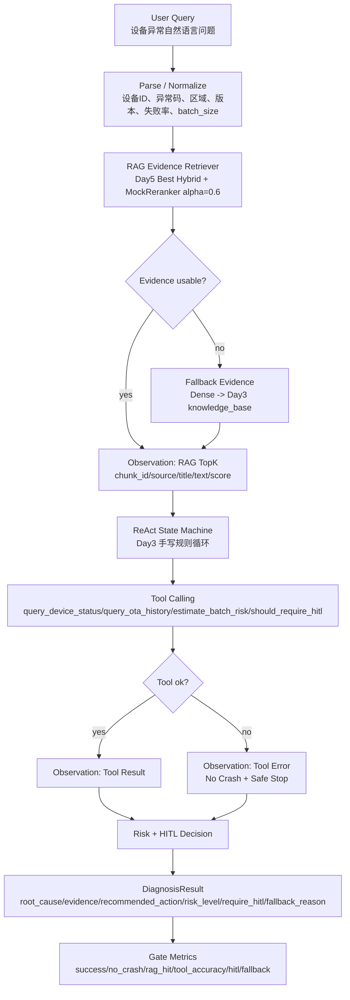

# Phase 0 Day 6 Survival Gate Plan

日期：Sat / Phase 0 Day 6  
主题：ReAct + RAG + Tool Calling 全链路通关测试  
上午时段：08:00-11:00 原理 / 通关设计 / 面试攻击点  
执行原则：今天是通关日，不继续开发新能力，只做 Day3、Day4、Day5 的可运行集成、测试和裁定。

## 1. 上午结论

Day6 的目标不是证明检索算法继续优化，也不是搭 Agent 框架，而是验证最小 Agent Runtime 闭环是否成立：

```text
User Query -> RAG Evidence -> ReAct State Machine -> Tool Calling -> DiagnosisResult
```

今日执行范围锁定为：

- 使用 Day5 最终检索配置：`Best Hybrid + MockReranker (Hybrid alpha=0.6)`。
- 将检索证据接入 Day3 手写 ReAct 决策流。
- 保留 Day3 安全边界：`max_steps=6`、工具白名单、未知异常码 fallback、工具异常转 Observation、HIGH 风险或大批量 HITL、离线设备暂缓 OTA。
- 不接真实 LLM，不接真实 OTA、脚本或重启。
- 不新增 Query Rewrite、GraphRAG、LangGraph、MCP、Redis、前端、WebSocket 或平台化服务。

仓库落地路径以 `day06_pass_test/` 为 Day6 根目录。上传计划中的 `app/...`、`tests/...`、`docs/...` 均映射到：

```text
day06_pass_test/app/...
day06_pass_test/tests/...
day06_pass_test/docs/...
```

这样可以避免和 Day1-Day5 的顶层 `app` 包发生导入冲突。

## 2. Day1-Day5 依赖审查清单

| 天数 | 关键产物 | Day6 用途 | 是否必接 | 上午裁定 |
|---|---|---|---|---|
| Day1 | Pydantic Schema / FastAPI 骨架 | 输入契约参考 | 可选 | 不拉入主链路，避免把通关测试变成 Web API 集成。 |
| Day2 | LLM Client / Token 计费 / Retry 分类 | 面试解释成本控制和失败分类 | 可选 | 不接真实 LLM，不让外部模型影响通关稳定性。 |
| Day3 | 手写 ReAct 状态机、ToolRegistry、DiagnosisResult | 核心决策层 | 必接 | 必须保留 `max_steps=6`、白名单、HITL、unknown fallback、tool error Observation。 |
| Day4 | RAG Pipeline、MockEmbedding、InMemory/Qdrant 路径、30 条 eval | 检索基线和语料来源 | 必接 | 不覆盖 Day4 dense baseline，只复用语料和评估边界。 |
| Day5 | Hybrid Retriever、BM25、MockReranker、alpha=0.6 最佳配置 | Day6 证据层 | 必接 | 默认使用 `Best Hybrid + MockReranker`，失败按 fallback ladder 降级。 |
| Day6 | Survival Gate | 全链路入口与通关裁定 | 必做 | 新增适配层、测试、报告；不重构 Day3/4/5 老模块。 |

## 3. 全链路流程设计



关键判断：

- RAG 只提供证据，不允许绕过 ReAct 安全判断。
- ReAct 仍是控制流核心，工具调用必须走白名单。
- 低置信、无结果、工具异常、未知异常码都必须安全降级。
- 高风险 OTA、脚本、批量操作只生成建议和 HITL 标记，不执行真实动作。

## 4. Day6 模块拆分

| 模块 | 计划文件 | 职责 |
|---|---|---|
| 输入与结果契约 | `day06_pass_test/app/agent/tms_agent.py` | 定义 Day6 通关输入、证据、工具观察和最终诊断结果的薄封装。 |
| 检索降级策略 | `day06_pass_test/app/agent/fallback_policy.py` | 定义 Hybrid -> Dense -> Day3 knowledge_base 的降级顺序和原因码。 |
| 主流程编排 | `day06_pass_test/app/agent/diagnosis_pipeline.py` | 串起 query -> retrieve -> react -> tool -> result，不新增 Agent 框架。 |
| Demo 入口 | `day06_pass_test/app/demo/survival_gate.py` | `python -m app.demo.survival_gate` 可运行，输出 10 条样例结果和指标摘要。 |
| 工具模拟 | `day06_pass_test/app/tools/device_tools.py` | 提供 Mock 设备状态、OTA 历史、批量风险、HITL 判断；不执行真实操作。 |
| 测试 | `day06_pass_test/tests/test_survival_gate.py` | 固定 10 条通关样例，验证无崩溃和指标。 |
| 报告 | `day06_pass_test/docs/day06-survival-gate-report.md` | 下午根据真实运行结果填写，不编造指标。 |
| 淘汰评估 | `day06_pass_test/docs/day06-elimination-review.md` | 晚上根据测试结果判定进入 Phase 1、补 Phase 0 或止损。 |

## 5. 检索层接入方案

优先路径：

```text
L1: Day5 Best Hybrid + MockReranker
    HybridRetriever.search(
      query,
      domain="tms",
      top_k=3,
      candidate_pool=10,
      fusion_method=WEIGHTED,
      alpha=0.6,
      rerank=True
    )
```

降级路径：

| 层级 | 条件 | 动作 | 结果要求 |
|---|---|---|---|
| L1 | Hybrid + Reranker 可用 | 使用 Day5 最佳配置 | 返回 TopK 证据，附 `method_scores`。 |
| L2 | Reranker 不可用 | 使用 Hybrid alpha=0.6，不 rerank | 记录 `RERANKER_FALLBACK`。 |
| L3 | Sparse/Hybrid 不可用 | 使用 Dense Only | 记录 `HYBRID_FALLBACK_TO_DENSE`。 |
| L4 | RAG 整体不可用或无结果 | 使用 Day3 `knowledge_base` 硬编码知识 | 记录 `RAG_FALLBACK_TO_RULE_KB`。 |
| L5 | 异常码未知且无证据 | 人工排查 | 记录 `UNKNOWN_ERROR_CODE_REQUIRE_MANUAL_CHECK`。 |

设计边界：

- 不继续调 alpha，不新增 Query Rewrite。
- 不因 Day5 Recall@3 达到 100% 就删除 HITL。
- Reranker 只重排候选，不能替代安全判断。
- `直播卡顿` 等 OTT Query 误入 TMS 时，只拒绝或路由提示，不做 OTT 业务处理。

## 6. ReAct 和 Tool Calling 接入方案

Day3 必须保留的控制机制：

| 机制 | Day6 要求 |
|---|---|
| `max_steps=6` | 保留，防止状态机或未来 LLM 接入后死循环。 |
| 工具白名单 | 保留，只允许 Day6 明确定义的 Mock 工具。 |
| 未知异常码 | 不胡编根因，进入人工排查。 |
| HIGH 风险 | 必须 HITL。 |
| `batch_size > 100` | 必须 HITL，不能全量自动执行。 |
| 设备离线 | 暂缓远程 OTA，转人工巡检或等待恢复在线。 |
| 工具异常 | 转 Observation，流程不能抛未捕获异常。 |
| 重复 Action | 安全终止并要求人工复核。 |

Day6 至少提供的 Mock 工具：

| 工具 | 用途 | 失败时处理 |
|---|---|---|
| `query_device_status(device_id)` | 返回在线状态、区域、Android 版本、固件版本、last_seen | Observation 记录工具错误，安全停止或人工排查。 |
| `query_ota_history(device_id)` | 返回最近 OTA 结果、失败次数和最后失败原因 | Observation 记录工具错误，不影响进程稳定性。 |
| `estimate_batch_risk(region, android_version, failure_rate_7d)` | 判断 LOW/MEDIUM/HIGH 风险 | 无法判断时按 HIGH 处理。 |
| `should_require_hitl(risk_level, batch_size)` | 判断是否需要人工审批 | 工具失败时默认 require_hitl=true。 |

## 7. 10 条通关样例设计

| 编号 | 输入 | 期望链路与结果 |
|---:|---|---|
| 1 | `OTA_TIMEOUT + Android 11 + 设备在线` | 检索 OTA 超时知识，查询设备和 OTA 历史，建议灰度重试。 |
| 2 | `DEVICE_OFFLINE` | 查询设备状态，发现离线，不建议直接 OTA。 |
| 3 | `FIRMWARE_MISMATCH` | 阻止升级，风险 HIGH，触发 HITL。 |
| 4 | `HIGH_FAILURE_RATE + 华南 + failure_rate_7d=0.18` | 风险 HIGH，建议先 100 台试点，不允许全量。 |
| 5 | `SCRIPT_EXEC_ERROR` | 建议沙箱复现，禁止直接重试，触发 HITL。 |
| 6 | `UNKNOWN_CODE` | 不编造根因，转人工排查。 |
| 7 | `OTA_TIMEOUT + RAG 无结果模拟` | 降级到 Day3 knowledge_base，仍输出安全建议。 |
| 8 | `设备工具异常模拟` | 工具异常转 Observation，无未捕获异常。 |
| 9 | `batch_size=500` | 必须 HITL，不允许自动批量 OTA。 |
| 10 | `直播卡顿误入 TMS` | 拒绝 TMS 诊断或提示路由到 OTT，不污染 TMS 结论。 |

最低合格线：

- 5 条核心 TMS 样例跑通。
- No Crash Rate = 100%。
- 失败原因可解释。

标准合格线：

- 10 条样例中至少 8 条端到端成功。
- No Crash Rate = 100%。
- 指标真实记录。

优秀线：

- 10/10 通过。
- RAG、Tool、HITL、Fallback 指标均达标。
- 面试话术能脱稿解释。

## 8. 通关指标

| 指标 | 计算方式 | 通关线 |
|---|---|---:|
| End-to-End Success Rate | 完整输出结构化 `DiagnosisResult` 的样例数 / 总样例数 | >= 80% |
| No Crash Rate | 无未捕获异常样例数 / 总样例数 | 100% |
| RAG Hit Rate@3 | RAG Top3 命中预期知识段的样例数 / 应命中样例数 | >= 70% |
| Tool Call Accuracy | 工具选择和参数正确样例数 / 应调用工具样例数 | >= 80% |
| HITL Trigger Accuracy | 高风险和大批量正确触发 HITL 的样例数 / 应触发样例数 | >= 90% |
| Fallback Correctness | RAG/工具失败时安全降级样例数 / 失败注入样例数 | >= 80% |
| Explanation Completeness | 能解释 Query、Evidence、Action、Observation、Final 每一步 | 100% |

注意：

- 指标只能来自下午真实测试结果。
- 不允许为了好看删除失败样例。
- 如果报告没有真实数字，视为 Day6 未通过。

## 9. 失败场景和处理策略

| 失败场景 | 预期行为 | 面试解释 |
|---|---|---|
| 未知异常码 | 不编造根因，输出人工排查和知识库补充建议 | Agent 可靠性的底线是知道自己不知道。 |
| RAG 无结果 | 降级 Dense 或 Day3 硬编码知识库，标记 fallback_reason | 检索失败不能让 Agent 输出无证据动作。 |
| RAG 命中 OTT/养老内容 | 拒绝污染 TMS 诊断，提示路由错误 | 领域边界比强行回答更重要。 |
| Reranker 不可用 | 退回 Hybrid alpha=0.6 或 Dense | Reranker 是排序增强，不是系统可用性的单点依赖。 |
| 工具异常 | 变成 Observation，流程不崩溃 | 工具失败是业务状态，不应该是进程崩溃。 |
| 设备离线 | 暂缓 OTA，不执行远程操作 | 离线设备无法验证结果，自动执行风险不可控。 |
| 高失败率 | 标记 HIGH 风险，HITL 审批 | 失败率高说明需要灰度和人工确认。 |
| 批量 500 台 | 必须 HITL，不允许自动全量 | 批量操作的 blast radius 必须受控。 |
| 重复 Action | 安全终止，转人工复核 | 重复动作说明状态机没有获得新信息。 |
| max_steps 超限 | 停止自动处置 | 防止 ReAct 死循环。 |

## 10. 面试攻击点表

| 问题 | 标准回答方向 |
|---|---|
| 为什么 Day6 不继续调 RAG？ | 今天是通关日，不是检索优化日；继续调参会污染 Day5 已完成的对照实验。 |
| 为什么要串 Day3/4/5？ | ReAct、RAG、Tool 单独跑通不等于 Agent 闭环；Day6 验证的是最小 Runtime。 |
| 为什么不用 LangGraph？ | Phase 0 要证明自己能解释状态机和安全边界；框架可以后续用，但不能替代核心理解。 |
| RAG 检索错了怎么办？ | 低置信或领域错配时 fallback，不把错误上下文硬塞给 ReAct。 |
| 工具调用失败怎么办？ | 工具失败转 Observation，给出安全终止或人工排查，不让进程崩溃。 |
| 高风险操作怎么办？ | 只生成建议和 HITL 标记，不直接执行 OTA、脚本或重启。 |
| AI 生成代码可以吗？ | 可以生成骨架、测试和文档，但通过/失败裁定、设计权衡和失败解释必须由工程师掌控。 |
| 如何判断 Phase 0 通过？ | 看全链路可运行、No Crash、指标、失败复盘和可解释性，不看演示是否好看。 |
| 为什么 MockReranker 可以接受？ | Day5 已明确真实 BGE 不是默认路径，Phase 0 目标是稳定闭环，MockReranker 是确定性兜底。 |
| 为什么不接真实 LLM？ | Day6 要验证 Runtime 闭环，不让模型波动和外部 API 影响通关判断。 |

## 11. 11:00 后执行锁定

11:00 进入上午实战后，只允许做这些事：

1. 创建 Day6 文件结构。
2. 写最小适配层，把 Day5 检索证据接入 Day3 风格状态机。
3. 写 10 条固定通关样例。
4. 跑 `python -m app.demo.survival_gate`。
5. 跑 `pytest -q tests/test_survival_gate.py`。
6. 根据真实输出生成报告和淘汰评估。

禁止事项：

- 不新增 WebSocket、LangGraph、MCP、Redis、前端或平台化服务。
- 不做 Query Rewrite、GraphRAG 或继续调 RAG。
- 不修改 Day3/4/5 已有基线来“制造通过”。
- 不编造指标。
- 不跳过失败样例。

## 12. 一句话技术判断

Phase 0 通关不是证明我会调模型，而是证明我能把 ReAct 状态机、RAG 检索层和工具调用层串成一个可运行、可测试、可解释的最小 Agent Runtime。今天不加功能，只验证全链路闭环、失败兜底和通关裁定。

